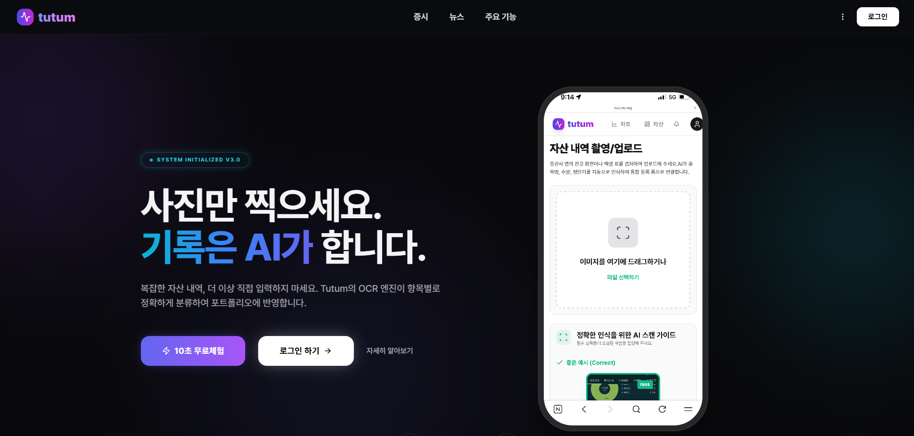
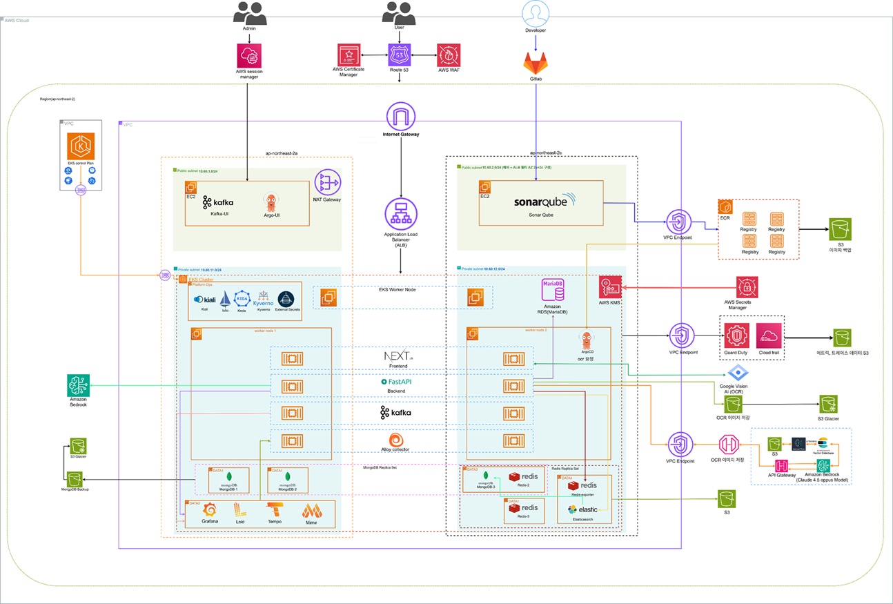
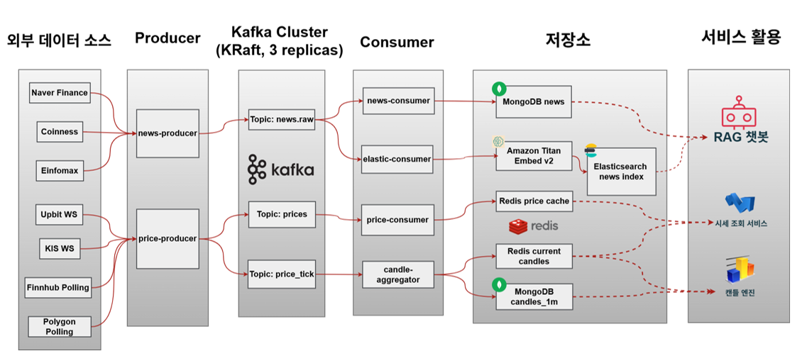
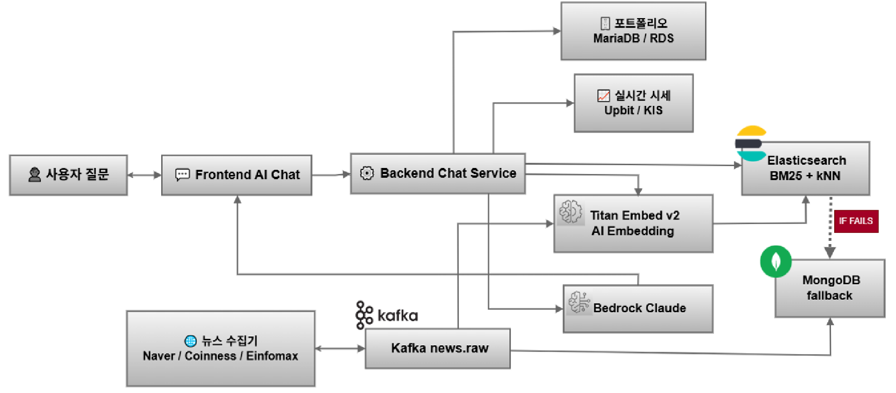
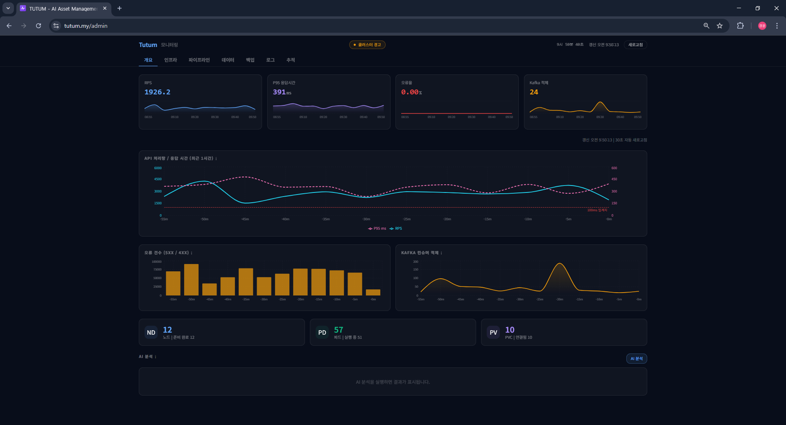

# TUTUM — AI 기반 자산관리 플랫폼


[tutum](https://kyungyoon.cloud/)



> 국내/해외 주식, 암호화폐, 뉴스, AI 분석을 하나의 서비스로 통합한 풀스택 핀테크 플랫폼


---

## 프로젝트 개요

TUTUM은 5인 팀이 약 2개월간 개발한 AI 자산관리 플랫폼입니다.
온프레미스 VM 3대에서 시작해 AWS EKS 기반의 프로덕션 클러스터로 직접 마이그레이션한 경험을 담고 있습니다.

| 항목 | 내용 |
|------|------|
| 개발 기간 | 2026.01 ~ 2026.03 (약 10주) |
| 팀 규모 | 5인 (인프라 2, 백엔드 2, 프론트엔드 1) |
| 운영 환경 | AWS EKS (`ap-northeast-2`) |
| 도메인 | tutum.my |

---

## 기술 스택

### 애플리케이션

| 레이어 | 기술 |
|--------|------|
| Frontend | Next.js 14, TypeScript, Tailwind CSS |
| Backend API | FastAPI (Python 3.11) |
| Auth Service | FastAPI + OAuth2 (Google, Kakao, Naver) |
| OCR Service | FastAPI + Google Cloud Vision API |

### 인프라 / DevOps

| 영역 | 기술 |
|------|------|
| Container Orchestration | AWS EKS (Kubernetes 1.31) |
| Node Autoscaling | Karpenter |
| GitOps | ArgoCD |
| CI/CD | GitLab CI (Build → Test → Push → Deploy) |
| Container Registry | Harbor (온프레미스) → AWS ECR |
| IaC | Terraform |
| Secret Management | AWS Secrets Manager + External Secrets Operator |
| Service Mesh / Ingress | AWS ALB Ingress Controller + WAF |
| DNS / TLS | Route 53 + ACM |

### 데이터 / AI

| 영역 | 기술 |
|------|------|
| Message Broker | Apache Kafka (KRaft, KEDA 오토스케일링) |
| Search Engine | Elasticsearch (벡터 + BM25 하이브리드 검색) |
| Vector Embeddings | Amazon Bedrock Titan Embed v2 |
| AI 응답 생성 | Amazon Bedrock Claude Sonnet 4.6 (스트리밍) |
| Primary DB | MongoDB (EKS 내부 ReplicaSet 3노드) |
| Relational DB | AWS RDS MariaDB |
| Cache | Redis |
| Object Storage | AWS S3 |

### 모니터링 (LGTM Stack)

| 도구 | 역할 |
|------|------|
| Grafana | 대시보드 / 알림 |
| Loki | 로그 수집 및 쿼리 |
| Tempo | 분산 트레이싱 |
| Mimir | 메트릭 장기 보관 |
| Grafana Alloy | 클러스터 내 수집 에이전트 (DaemonSet) |
| SonarQube | 코드 품질 정적 분석 |

---

## 인프라 아키텍처

### AWS EKS 클러스터 구성

```
Internet
    │
    ▼
Route 53 (tutum.my)
    │
    ▼
ALB + WAF + ACM (TLS)
    │
    ▼
┌─────────────────────────────────────────────────────┐
│              EKS Cluster (tutum-stg-eks)             │
│                                                     │
│  tutum-app namespace                                │
│  ┌──────────┐ ┌──────────┐ ┌──────┐ ┌─────────┐   │
│  │ Next.js  │ │ FastAPI  │ │ Auth │ │   OCR   │   │
│  │ Frontend │ │ Backend  │ │ API  │ │   API   │   │
│  └──────────┘ └──────────┘ └──────┘ └─────────┘   │
│                                                     │
│  tutum-data namespace                               │
│  ┌───────────────┐ ┌───────┐ ┌───────────────────┐ │
│  │ MongoDB RS    │ │ Redis │ │ Kafka (KRaft)      │ │
│  │ (3 replicas)  │ │       │ │ + Elasticsearch    │ │
│  └───────────────┘ └───────┘ └───────────────────┘ │
│                                                     │
│  tutum-workers namespace                            │
│  ┌─────────────────────────────────────────────┐   │
│  │ news-producer │ news-consumer                │   │
│  │ elastic-consumer │ price-producer            │   │
│  │ price-consumer  (KEDA 오토스케일)             │   │
│  └─────────────────────────────────────────────┘   │
│                                                     │
│  monitoring namespace                               │
│  ┌───────────────────────────────────────────────┐ │
│  │ Grafana Alloy (DaemonSet) + Exporters         │ │
│  │ SonarQube                                     │ │
│  └───────────────────────────────────────────────┘ │
└─────────────────────────────────────────────────────┘
         │                      │
         ▼                      ▼
  AWS RDS MariaDB        Monitoring EC2
  (관계형 DB)            Grafana / Loki
                         Tempo / Mimir
         │
         ▼
  AWS S3 + Bedrock + Secrets Manager
```

### 온프레미스 → AWS EKS 마이그레이션

프로젝트 초기에는 VirtualBox 기반 3-Node VM 클러스터에서 Docker Compose로 운영했습니다.
이후 직접 설계한 EKS 클러스터로 전체 워크로드를 단계별로 마이그레이션했습니다.

```
[AS-IS] VirtualBox 3-Node VM + Docker Compose
  Node1: Nginx + Frontend + Backend
  Node2: Redis + MinIO + Harbor (프라이빗 레지스트리)
  Node3: Elasticsearch + Kafka (KRaft) + Workers
  MongoDB Atlas (클라우드)

         ↓ 약 2주간 직접 설계 및 마이그레이션

[TO-BE] AWS EKS (ap-northeast-2)
  Route53 → ALB(WAF+ACM) → EKS Private Subnet
  Karpenter 노드 오토스케일링 (Bottlerocket)
  GitOps: ArgoCD + GitLab CI
  Terraform IaC (VPC, EKS, RDS, ECR, Secrets Manager)
  External Secrets Operator (AWS Secrets Manager 연동)
```

**마이그레이션 주요 단계**

| Phase | 내용 | 핵심 작업 |
|-------|------|----------|
| Phase 0 | 사전 준비 | Dockerfile 작성, Health endpoint, 환경변수 분리 |
| Phase 1 | K8s 클러스터 구축 | 온프레미스 3-Node K8s → EKS Auto Mode 전환 |
| Phase 2 | 네트워크 / 보안 | VPC, ALB Ingress, WAF, ACM, Route53 설정 |
| Phase 3 | 데이터 레이어 | MongoDB Atlas → EKS StatefulSet(3replica), RDS MariaDB |
| Phase 4 | 애플리케이션 배포 | Harbor → ECR 전환, 전체 워크로드 K8s 매니페스트화 |
| Phase 5 | GitOps 구성 | ArgoCD + GitLab CI 연동, 자동 배포 파이프라인 완성 |
| Phase 6 | 오토스케일링 | KEDA (Kafka lag 기반) + Karpenter (노드 레벨) |
| Phase 7 | 시크릿 관리 | AWS Secrets Manager + ESO 도입, 기존 평문 제거 |
| Phase 8 | 모니터링 | LGTM Stack 전용 EC2 구성, Alloy DaemonSet 배포 |

**주요 설계 결정**

- **단일 VPC 채택**: GitLab SaaS + EKS 내 Runner 방식으로 CI/CD VPC 불필요
- **Harbor → ECR**: 온프레미스 레지스트리 운영 부담 제거, IAM 기반 인증으로 전환
- **SSH → SSM**: EC2 키페어 대신 AWS Systems Manager Session Manager로 접근 방식 변경
- **Monitoring EC2 분리**: LGTM 스택을 EKS 외부 전용 EC2에 분리하여 클러스터 장애와 모니터링 독립
- **Kafka KRaft**: Zookeeper 제거, 단일 프로세스 내장 합의 모드로 운영 단순화

---

## AI & 데이터 파이프라인

### 뉴스 수집 파이프라인

```
[네이버 금융]  ─┐
[Coinness]    ─┼─► news-producer ──► Kafka(news.raw) ──► news-consumer ──► MongoDB
[Einfomax]    ─┘    (30s 폴링)                       │
                                                     └──► elastic-consumer ──► Elasticsearch
                                                              (Titan Embed v2 벡터 임베딩)
```

- Kafka KRaft 클러스터 (Zookeeper 없는 내장 합의 모드)
- KEDA: Kafka consumer lag 기반 워커 파드 오토스케일링
- Elasticsearch에 BM25 인덱스 + 벡터 인덱스 동시 보유

### AI 챗봇 RAG 파이프라인

```
사용자 질문
    │
    ▼
키워드 추출 + 유사어 확장
    │
    ├──► 실시간 시세 조회 (KIS / Upbit API)
    ├──► 포트폴리오 조회 (RDS MariaDB)
    └──► 뉴스 검색
              │
              ├──► Elasticsearch 하이브리드 검색
              │    (BM25 60% + kNN 벡터 40%)
              └──► 실패 시 MongoDB fallback
    │
    ▼
Amazon Bedrock Claude Sonnet 4.5
(Server-Sent Events 스트리밍 응답)
```

### 실시간 시세 파이프라인

```
[KIS WebSocket]  ─┐
[Upbit WebSocket] ─┼─► price-producer ──► Kafka(prices / price_tick)
                          │
                          ├──► price-consumer ──► Redis (최신 가격 캐시)
                          └──► candle-consumer ──► MongoDB (캔들 데이터)
```

---

## CI/CD & GitOps 흐름

```
코드 Push (GitLab)
    │
    ▼
GitLab CI Pipeline
  ├── [Test] SonarQube 정적 분석
  ├── [Build] Docker 이미지 빌드
  ├── [Push] Harbor / ECR 푸시
  └── [Deploy] k8s-manifests 이미지 태그 자동 업데이트
          │
          ▼
      ArgoCD (GitOps)
          │
          ▼
      EKS 클러스터 자동 배포
```

- Slack + Jira 연동: 파이프라인 성공/실패 알림 자동화
- GitLab Group Runner (K8s executor)
- develop 브랜치 push 시 staging 자동 배포

---

## 모니터링


LGTM 스택을 직접 구축하여 애플리케이션부터 인프라까지 전 구간 관측성을 확보했습니다.

### LGTM 스택 구성

```
┌─────────────────── EKS 클러스터 ───────────────────┐
│                                                    │
│  백엔드 파드 ──OTel gRPC──▶ Alloy (DaemonSet)      │
│  node-exporter              ├─ Mimir (메트릭)      │
│  redis-exporter             ├─ Loki  (로그)        │
│  kafka-exporter             └─ Tempo (트레이싱)    │
│  elasticsearch-exporter                            │
└───────────────────────┬────────────────────────────┘
                        │ push
               Monitoring EC2 (외부 분리)
               Grafana / Loki / Mimir / Tempo
```

| 구성 요소 | 역할 | 비고 |
|----------|------|------|
| Grafana Alloy | 클러스터 내 수집 에이전트 (DaemonSet) | OTel 수신 + 원격 push |
| Mimir | Prometheus 호환 메트릭 장기 보관 | S3 백엔드 |
| Loki | 구조화 로그 수집 및 쿼리 | 레이블 기반 필터링 |
| Tempo | 분산 트레이싱 | TraceID 기반 요청 추적 |
| Grafana | 통합 대시보드 / 알림 | Slack 연동 |

**수집 익스포터**: kafka-exporter, redis-exporter, elasticsearch-exporter, node-exporter

### 커스텀 Admin 대시보드 (`/admin`)

Grafana 외에 서비스 전용 Admin 모니터링 페이지를 직접 구현했습니다.
팀원 누구나 코드 없이 현재 서비스 상태를 즉시 파악할 수 있도록 설계했습니다.

| 탭 | 내용 |
|----|------|
| Overview | 전체 서비스 헬스, 파드 상태, 주요 지표 요약 |
| Infra | CPU/메모리/디스크 사용률, 노드 상태 |
| Pipeline | Kafka lag, 뉴스 수집량, 임베딩 처리량 |
| Logs | Loki 연동 실시간 로그 뷰어 |
| Traces | Tempo 연동 분산 트레이싱 뷰어 |
| AI 분석 | Bedrock 기반 서비스 이상 징후 AI 진단 |

> 관련 문서: [Admin 모니터링 가이드](docs/guides/ADMIN_MONITORING_GUIDE.md)

---

## 주요 기능

- 국내/해외 주식, 암호화폐 실시간 시세 및 캔들 차트
- OCR 기반 자산 증권 인식 자동 입력
- AI 챗봇 (포트폴리오 + 뉴스 RAG 기반 투자 인사이트)
- Google / Kakao / Naver 소셜 로그인
- 자산 포트폴리오 관리 및 수익률 분석
- 관리자 대시보드 (LGTM 모니터링 연동)

---

## 디렉토리 구조

```
clouddx-project/
├── backend/                    # FastAPI 백엔드 + Kafka Workers
│   ├── app/
│   │   ├── routers/            # API 엔드포인트 (chat, market, portfolio, ocr...)
│   │   ├── services/           # 비즈니스 로직
│   │   ├── models/             # DB 모델
│   │   └── ocr-api/            # OCR 전용 서비스 (Google Cloud Vision)
│   └── workers/                # Kafka Producer/Consumer
│       ├── producer_news.py    # 뉴스 수집 (Naver/Coinness/Einfomax)
│       ├── consumer_news.py    # MongoDB 저장
│       ├── elastic_consumer.py # Elasticsearch 임베딩 인덱싱
│       ├── producer_price.py   # 실시간 시세 수집 (KIS/Upbit)
│       └── consumer_price.py   # Redis 캐시 + MongoDB 캔들
├── frontend/                   # Next.js 14 프론트엔드
│   └── frontend/               # 실제 앱 코드
│       ├── app/                # App Router 페이지
│       ├── components/         # UI 컴포넌트
│       └── hooks/              # 커스텀 훅
├── auth/                       # FastAPI 인증 서비스
│   └── app/
│       ├── routers/auth.py     # OAuth2 (Google, Kakao, Naver) + JWT
│       └── services/           # 이메일 인증, 큐 처리
├── k8s-manifests/              # Kubernetes 매니페스트 (ArgoCD GitOps)
│   └── base/
│       ├── backend/            # Backend Deployment/Service/HPA
│       ├── frontend/           # Frontend Deployment/Service
│       ├── workers/            # Kafka Worker Deployments (KEDA)
│       ├── data/               # MongoDB, Redis, Kafka, ES StatefulSet
│       ├── monitoring/         # Alloy DaemonSet, Exporters
│       └── security/           # ESO, Kyverno, RBAC
├── terraform/                  # AWS 인프라 IaC
│   ├── eks/                    # EKS 클러스터, Karpenter
│   ├── vpc/                    # VPC, Subnet, NAT GW
│   ├── rds/                    # RDS MariaDB
│   └── ecr/                    # ECR 레포지토리
├── docs/                       # 아키텍처 문서 및 가이드
│   ├── guides/                 # AI, K8s, Kafka, OCR 운영 가이드
│   └── plans/                  # 인프라/백엔드 아키텍처 설계 문서
├── infra/                      # Docker Compose, Harbor, Kibana 설정
├── scripts/                    # 배포 / 운영 스크립트
└── tests/                      # 통합 테스트 스크립트
```

---

## 문서

| 문서 | 설명 |
|------|------|
| [AI 파이프라인 가이드](backend/docs/guides/AI_PIPELINE_GUIDE.md) | 뉴스 수집 ~ RAG 응답 전 구간 설명 |
| [Kafka 파이프라인 아키텍처](backend/docs/plans/backend/KAFKA_PIPELINE_ARCHITECTURE_2026-03-17.md) | Kafka 토픽 설계 및 KEDA 연동 |
| [챗봇 RAG 아키텍처](backend/docs/plans/backend/CHATBOT_RAG_PIPELINE_ARCHITECTURE_2026-03-17.md) | RAG 흐름 상세 설계 |
| [K8s 클러스터 구조](backend/docs/plans/infra/K8S_CLUSTER_STRUCTURE_GUIDE.md) | EKS 네임스페이스 및 노드 구성 |
| [AWS 스테이징 토폴로지](backend/docs/plans/infra/AWS_STAGING_TOPOLOGY_ARCHITECTURE_2026-03-16.md) | AWS 리소스 전체 인벤토리 |
| [관리자 모니터링 가이드](backend/docs/guides/ADMIN_MONITORING_GUIDE.md) | LGTM 대시보드 운영 가이드 |
| [K8s 가용성 가이드](backend/docs/guides/K8S_AVAILABILITY_GUIDE.md) | PDB, HPA, 헬스체크 설정 |
| [전체 문서 인덱스](backend/docs/README.md) | 문서 전체 목록 |

---

## 로컬 실행 (개발 환경)

### 사전 요구사항

- Python 3.11+
- Node.js 20+
- Docker + Docker Compose
- `.env` 파일 설정 (`backend/.env.example` 참고)

### 백엔드

```bash
cd backend
python -m venv .venv
source .venv/bin/activate  # Windows: .venv\Scripts\activate
pip install -r requirements.txt
cp .env.example .env       # 환경 변수 설정 후
uvicorn app.main:app --reload --port 8000
```

### 프론트엔드

```bash
cd frontend
npm install
npm run dev
```

### 전체 스택 (Docker Compose)

```bash
docker compose up -d --build
```

| 서비스 | 포트 |
|--------|------|
| Frontend | 3000 |
| Backend | 8000 |
| MongoDB | 27017 |
| Redis | 6379 |
| Kafka | 9092 |
| Elasticsearch | 9200 |
| MinIO | 9000 / 9001 |

---

## 주의사항

- 실제 API 키/비밀번호는 `.env`에만 보관하고 Git에 커밋하지 않습니다
- K8s 시크릿은 AWS Secrets Manager + ESO로 관리하며 `secret.yaml`은 구조 참조용입니다
- `k8s-manifests/`의 모든 실제 값은 AWS Secrets Manager에서 ESO가 자동 주입합니다
