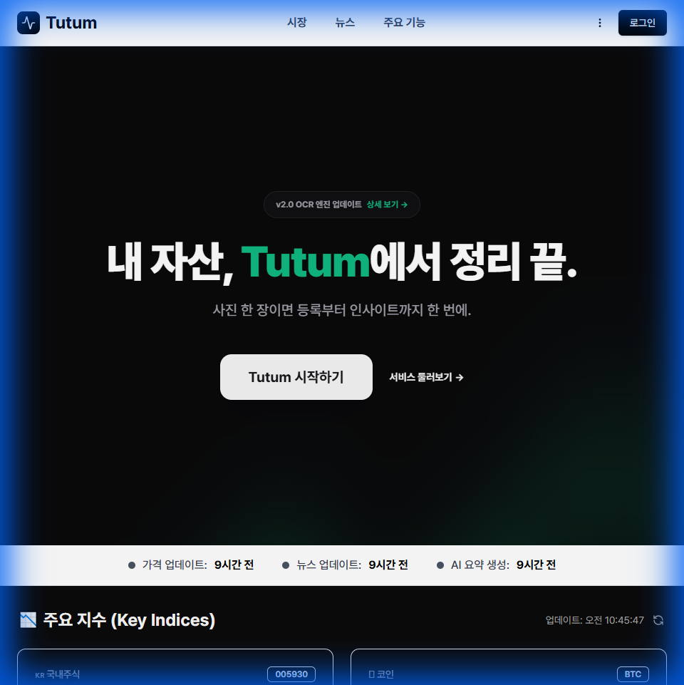
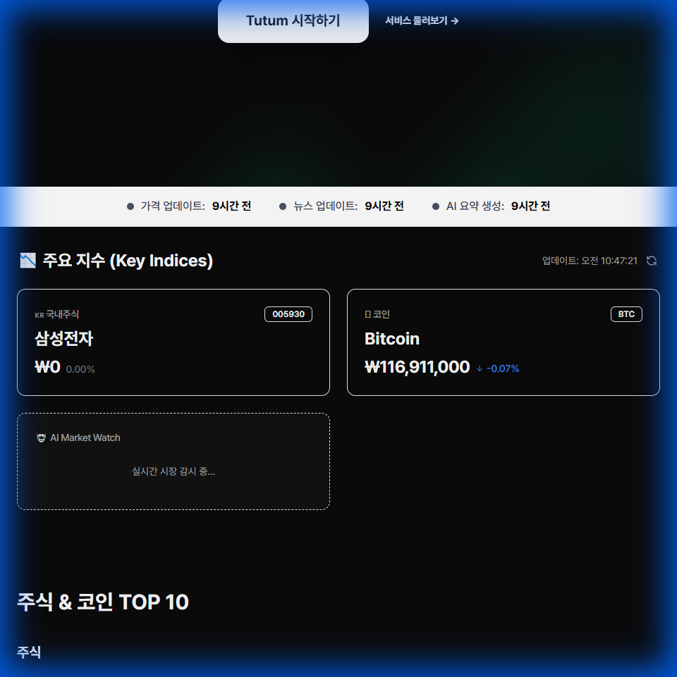
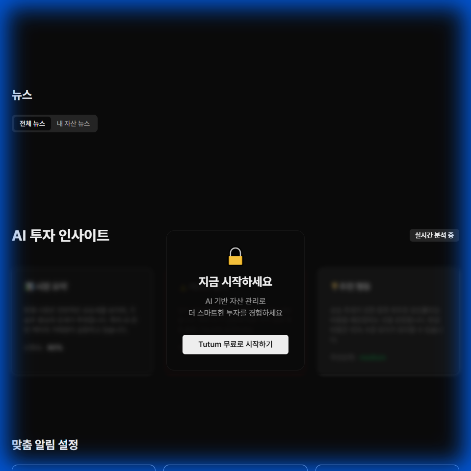

# 📅 개발 작업 완료 보고서 (2026-01-27)

## 📌 작업 개요
**작성자**: `kyk02405`
**Jira Ticket**: `KAN-101` (추정)
**작업 내용**: UI 컴포넌트 통합 및 프론트엔드 목업(Mock) 데이터 구현

## 1. 🧩 UI/UX 통합 (Frontend)
-   **Component Library**: 공통 UI 컴포넌트 (`Button`, `Card`, `Input` 등) 모듈화
-   **Context API**: `AuthContext` 및 `ThemeContext` 초기 구조 잡기
-   **Page Development**:
    -   `Dashboard`: 자산 현황 요약 카드 및 차트 영역 배치
    -   `Portfolio`: 보유 자산 리스트 테이블 구현
    -   `Market`: 실시간 시세(가상) 표시 영역 구현

## 2. 🔌 Mock Data 구현
-   **Prototyping**: 백엔드 API 연동 전 프론트엔드 단독 테스트를 위한 가상 데이터 생성 (`lib/mock-data.ts`)
-   **Types**: `User`, `Asset`, `Order` 등 핵심 도메인 타입 정의 (`types/index.ts`)

## 3. 🐛 버그 수정
-   UI 깨짐 현상 및 모바일 뷰에서의 사이드바 오버레이 문제 수정
-   git merge 충돌 해결 (`develop` 브랜치 병합)

## 4. 📸 UI 스크린샷

### 랜딩 페이지 (Landing Page)

### 주요 지수 섹션 (Market Section)

### AI 투자 인사이트 섹션 (News Section)

---
**✅ 결론**: 프론트엔드 레이아웃과 데이터 흐름을 연결하여, 시각적으로 동작하는 애플리케이션 형태를 갖추었습니다.
