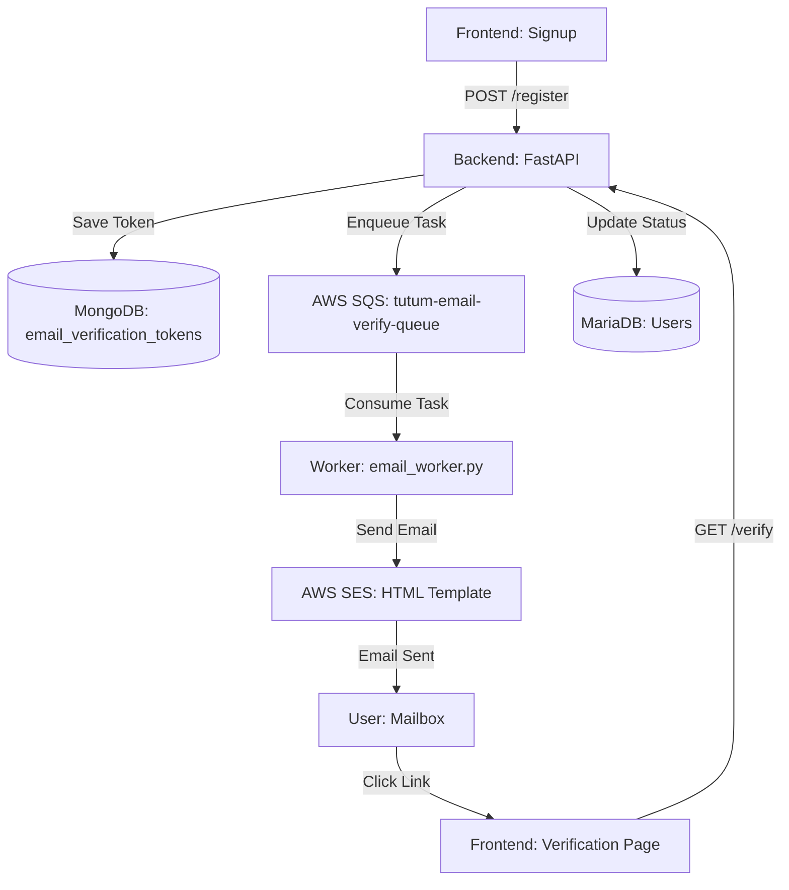

# ✅ 개발 작업 완료 보고서 (2026-02-13)

## ✅ 작업 개요

**작성자**: `Ruby Kim`  
**Jira Ticket**: `N/A` (Email Infrastructure)
**Branch**: `kyk/0213-merge` (Finalized)
**작업 내용**: AWS SQS + SES 기반 비동기 이메일 인증 시스템 구축 완료

## 1. 🧩 시스템 아키텍처

## 2. 🛠️ 구현 상세

### 2.1 Backend (FastAPI)

- **보안 토큰 생성**: `secrets.token_urlsafe(32)`를 사용한 고유 인증 토큰 생성.
- **해시 저장**: 데이터베이스(MongoDB)에는 SHA-256으로 해싱된 토큰(`token_hash`)만 저장하여 보안 강화.
- **인증 멱등성**: 이미 인증된 사용자가 인증 링크를 재클릭했을 때의 예외 처리 및 성공 응답 유지.
- **재발송 서비스**: 기존 미사용 토큰 무효화 처리 후 신규 토큰 발송 로직 구현.

### 2.2 비동기 워커 (SQS Consumer)

- **Long Polling**: SQS `receive_message` 시 20초 대기(WaitTimeSeconds)를 설정하여 API 호출 최적화 및 비용 절감.
- **DLQ (Dead Letter Queue)**: 3회 실패 시 `tutum-email-verify-dlq`로 메시지 자동 이동 설정.
- **SES Sandbox 대응**: 샌드박스 환경에서의 발신 제한 사항(Identity 미인증)에 대한 명확한 로그 가이드 추가.

### 2.3 Frontend Integration

- **인증 전용 페이지**: `/auth/verify-email` 경로에서 토큰 검증 및 결과 시각화.
- **폴링/상태 확인**: 회원가입 후 이메일 인증 대기 화면에서 백엔드 `is_verified` 상태를 확인하는 UX 흐름 구축.

## 3. 🧾 주요 파일 목록

- `backend/app/services/email_service.py`: SES 연동 및 HTML 템플릿 관리
- `backend/app/services/queue_service.py`: SQS 큐 생성 및 메시지 발송 로직
- `backend/workers/email_worker.py`: 백그라운드 메시지 소비 워커
- `backend/app/routers/auth.py`: `/register`, `/verify`, `/resend-verification` 엔드포인트

---

**회고**: SQS와 SES를 연계하여 사용자 등록 시 발생할 수 있는 네트워크 지연이나 외부 API 병목을 완전히 제거함. 특히 가동 속도와 확장성을 고려한 Worker 구조를 채택하여 향후 대규모 마케팅 메일 발송 등으로의 확장 기반을 마련함.
