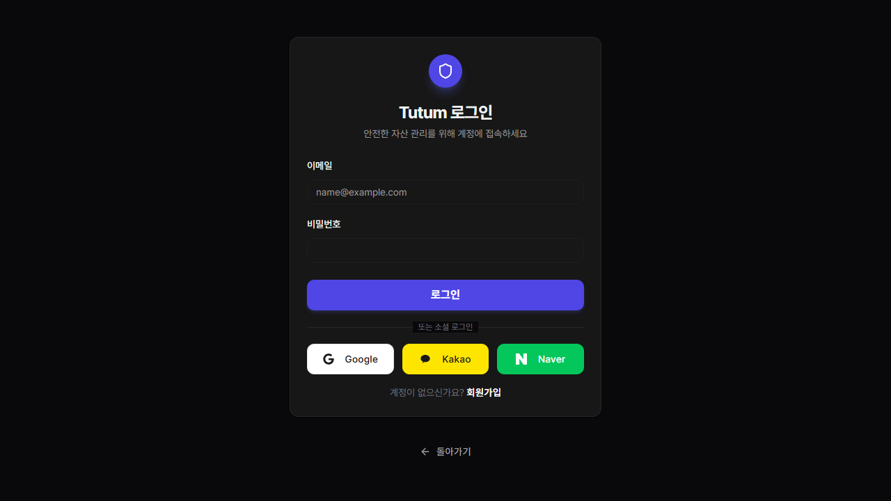

# 개발 로그 작업 요약 (2026-03-14)

## 1. 작업 요약
- 작업 일시: 2026-03-14
- 작업자: 김경윤
- 브랜치: develop
- 작업 목적: AI 투자 질의에서 포트폴리오 편향으로 RAG 문맥이 어긋나는 문제를 줄이고, AI 창을 닫았다가 다시 열면 직전 대화가 사라지는 UX 문제를 함께 수정한다.

## 2. 상세 변경 사항
- `backend/app/services/chat_service.py`
  - 질문 본문 키워드와 포트폴리오 보강 키워드를 분리했다.
  - 질문에 명시적 종목/ETF/티커가 있으면 포트폴리오 키워드를 무조건 섞지 않도록 질의 의도 판별 로직을 추가했다.
  - `TQQQ`, `QQQ`, `SPY`, `SOXL`, `SOXX` 등 주식/ETF 심볼을 인식해 주가 컨텍스트를 붙일 수 있도록 KIS 현재가 조회를 연동했다.
  - 뉴스 RAG 검색은 최근 14일 문서를 우선 조회하고, 결과가 없을 때만 오래된 문서로 fallback 하도록 조정했다.
- `frontend/frontend/hooks/useChat.ts`
  - 메시지 배열을 `sessionStorage`에 저장하고, 훅 초기화 시 복원하도록 변경했다.
  - 같은 탭 안에서 FAB와 전용 AI 페이지가 동시에 갱신될 수 있도록 커스텀 sync 이벤트를 추가했다.
  - 메시지 추가, 스트리밍 갱신, 초기화가 모두 저장소와 함께 갱신되도록 `setMessagesAndPersist` 경로로 통합했다.
- `frontend/frontend/components/QuickBar.tsx`
  - AI 패널을 닫을 때 `AIChatFAB`를 언마운트하지 않고, 열림 상태만 전환하도록 구조를 조정했다.
  - 기존 퀵바와 AI 패널이 동시에 렌더링되지 않도록 `isChatOpen` 분기 로직을 추가했다.

## 3. 작업 중 발생 이슈 및 대응
- 이슈: `TQQQ` 같은 질문에도 사용자 포트폴리오의 BTC 비중이 RAG 검색어에 강하게 섞여 코인 뉴스가 우선 노출됐다.
- 대응:
  - 명시적 자산 질문인지 먼저 판별한 뒤, 그 경우에는 포트폴리오 키워드 보강을 제한했다.
  - 주식/ETF 가격 컨텍스트가 비어 있던 경로를 보완해 질문 대상 자산 기준 문맥이 더 앞에 오도록 조정했다.
- 이슈: AI FAB를 닫으면 `useChat` 훅 상태가 함께 사라져 재오픈 시 직전 대화가 모두 초기화됐다.
- 대응:
  - `QuickBar`에서 패널 닫힘과 컴포넌트 언마운트를 분리했다.
  - `sessionStorage` 복원 로직을 추가해 같은 브라우저 세션에서는 대화가 유지되도록 변경했다.
- 이슈: 로컬 UI 스크린샷 캡처용 브라우저 바이너리가 PATH에 없었다.
- 대응:
  - `npx playwright@latest install chromium`로 headless Chromium을 설치하고 캡처를 수행했다.

## 4. 결과
- 백엔드 검증
  - `python -m py_compile backend/app/services/chat_service.py backend/app/routers/chat.py backend/app/routers/news.py backend/workers/producer_news.py backend/workers/consumer_news.py backend/workers/elastic_consumer.py` 통과
- 프론트엔드 검증
  - `npm ci` 완료
  - `npm run lint -- --file frontend/hooks/useChat.ts --file frontend/components/QuickBar.tsx` 통과
  - `npm run build` 통과
- 타입체크 메모
  - `npx tsc --noEmit`는 기존 `.next/types/**/*.ts` include 경로의 누락 파일 때문에 실패했지만, `next build`의 타입 검사 단계는 통과했다.
- UI 스크린샷
  - `../screenshots/2026-03-14/ai_chat_page.png`
  - 

## 5. 커밋 로그
```bash
git log --oneline --since="2026-03-14 00:00:00" --until="2026-03-14 23:59:59"
```

## 6. 후속 작업/리스크
- `sessionStorage` 기반 유지이므로 브라우저 세션이 완전히 종료되면 대화는 초기화된다.
- 스테이징 운영 전환 전에는 `full down -> full up` 왕복 테스트로 복구 시간과 누락 리소스를 실제로 검증해야 한다.
- 직접 `tsc --noEmit`가 아니라 `next build`를 기준 검증으로 사용하고 있으므로, `.next/types` include 정리는 별도 작업으로 남아 있다.
