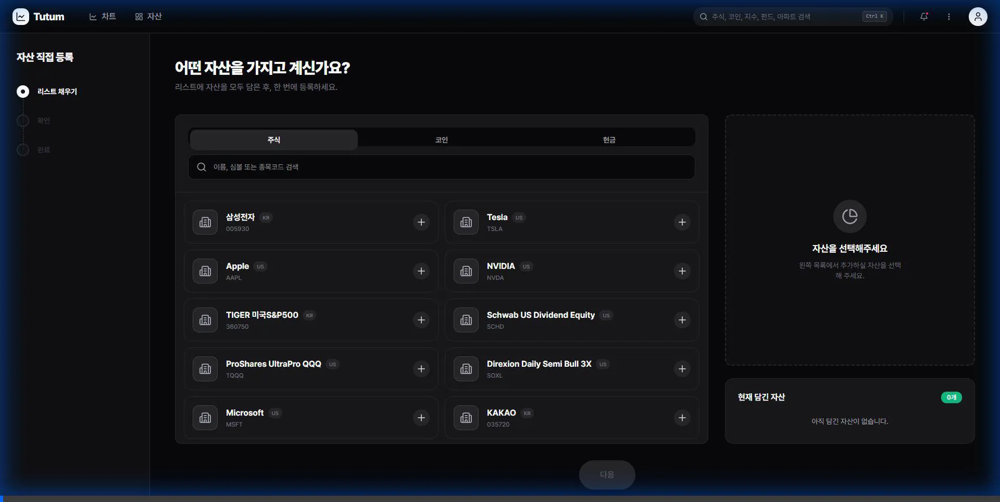

# 📅 개발 작업 완료 보고서 (2026-02-04)

## 📌 작업 개요
**작성자**: `antigravity`
**Branch**: `feature/direct-asset-input-ux`
**작업 내용**: 직접 자산 등록(Direct Input) 페이지 UX 개선 (숫자 포맷팅, 수정/삭제, 현금 탭 개선)

## 1. 🔧 주요 변경 사항

### A. Frontend (`frontend/app/direct-input/page.tsx`)
-   **Number Formatting**: `quantity`, `price` 입력 필드에 천 단위 콤마(,) 자동 포맷팅 적용
    -   `formatNumber`, `parseNumber` 헬퍼 함수 구현
    -   `inputMode="decimal"` 속성 추가로 모바일 사용성 개선
-   **Edit Mode (수정 기능)**:
    -   Mini Cart(우측 하단 프리뷰) 아이템 클릭 시 입력 폼에 데이터 바인딩
    -   "리스트에 추가" 버튼이 "자산 수정하기"(초록색)로 변경되며 업데이트 로직 수행
-   **Delete Function (삭제 기능)**:
    -   Mini Cart 아이템에 휴지통 아이콘(Trash2) 추가 및 삭제 로직 구현
-   **Cash Tab UX (현금 탭 개선)**:
    -   `AssetContext`의 `exchangeRates`를 활용하여 환율 정보 자동 연동
    -   USD, JPY 등 외화 선택 시 환율(Price) 자동 입력
    -   KRW(원화) 선택 시 환율 입력 필드 숨김 처리 (자동 1.0 적용)
    -   입력된 외화 금액에 대해 "≈ X,XXX KRW" 형태의 원화 환산 추정액 실시간 표시

## 2. 🐛 버그 수정
-   **Overseas Stock API Path**: `market_data.py`에서 해외 주식 시세 조회 시 국내 API 경로를 호출하던 버그 수정 -> `/uapi/overseas-price/v1/quotations/price` 경로로 분기 처리

## 3. 📸 UI 스크린샷

### 직접 자산 등록 UX 검증 (Direct Asset Input Verification)
> 숫자 포맷팅, 수정 모드, 환율 자동 계산 확인

## 4. 📝 커밋 내역
-   Feat: Implement number formatting for Quantity/Price
-   Feat: Add Edit/Delete functionality to Mini Cart
-   Feat: Improve Cash tab UX with auto exchange rate and KRW estimation
-   Fix: Resolve Overseas Stock API path issue in backend
