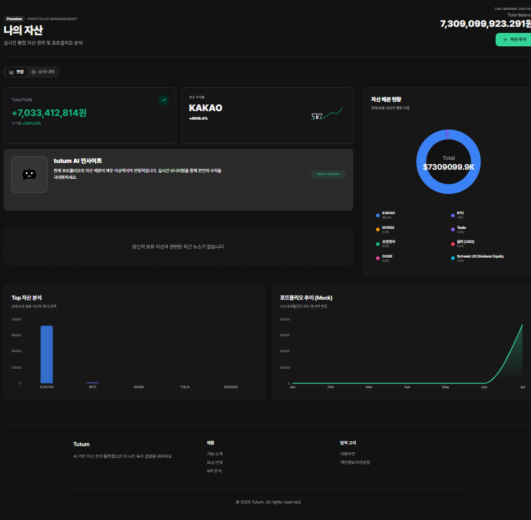

# 📅 통합 브랜치 머지 완료 보고서 (2026-02-04)

## 📌 작업 개요
**작성자**: `kyk02405`
**Branch**: `kyk0204/merge`
**작업 내용**: 다중 팀원 브랜치 통합 - 실시간 API, UI/UX 개선, 이모지 수정, KRW 차트 기능 통합



## 1. 🔧 브랜치 통합 전략

### 1.1 통합된 브랜치들
```
kyk0204/merge
    ├── jun/dev0204 (base)
    │   ├── develop
    │   │   └── kyk/0203api-emoji
    │   │       ├── 이모지 인코딩 오류 수정
    │   │       └── KRW 차트 기능 추가
    │   └── 실시간 API 연동 기능
    └── ruby-backup0204
        ├── UI/UX 최종 완성 (bc6ceb8)
        │   ├── tutum 브랜딩
        │   ├── AI Insights V7
        │   ├── 스파크라인 차트
        │   └── KRW 정규화
        └── OCR API 연결 수정 (53b6734)
```

### 1.2 머지 순서
1. `kyk/0203api-emoji` → `develop` (Fast-forward)
2. `develop` → `jun/dev0204` (Merge commit)
3. `jun/dev0204` → `kyk0204/merge` (Branch creation)
4. `ruby-backup0204` → `kyk0204/merge` (Merge commit)

## 2. 🎯 통합된 주요 기능

### 2.1 실시간 API 연동 (from jun/dev0204)
| 기능 | 파일 | 설명 |
|------|------|------|
| 다중 시세 조회 | `backend/app/routers/market.py` | 여러 코인/주식 일괄 조회 API |
| 실시간 코인 시세 | `frontend/lib/hooks/useCoins.ts` | Upbit API 연동, 30초 자동 갱신 |
| 포트폴리오 갱신 | `frontend/context/AssetContext.tsx` | Mock 데이터 → 실제 시세 조회 |
| 코인 상세 차트 | `frontend/app/coin/[symbol]/page.tsx` | AdvancedChart 컴포넌트 통합 |
| 관심종목 실시간 | `frontend/components/WatchlistSidebar.tsx` | 실시간 시세 표시 |

### 2.2 UI/UX 개선 (from ruby-backup0204)
| 기능 | 파일 | 설명 |
|------|------|------|
| 개인화 뉴스 캐러셀 | `frontend/components/PersonalizedNewsCarousel.tsx` | 보유 자산 기반 뉴스 표시 |
| 대시보드 차트 | `frontend/components/PortfolioDashboardCharts.tsx` | 스파크라인 차트 통합 |
| tutum 브랜딩 | `frontend/app/globals.css` | 일관된 디자인 시스템 |
| AI Insights V7 | `backend/app/routers/news.py` | 개인화 뉴스 추천 로직 |
| 로봇 이미지 추가 | `public/images/cute_robot.png` | UI 비주얼 개선 |

### 2.3 시스템 안정성 개선 (from kyk/0203api-emoji)
| 기능 | 파일 | 설명 |
|------|------|------|
| 이모지 인코딩 수정 | `backend/app/services/market_data.py` | Windows cp949 호환성 확보 |
| OCR 로그 정규화 | `backend/app/ocr-api/app/main.py` | 8가지 이모지 타입 교체 |
| KRW 환산 로직 | `frontend/components/ChartSidebar.tsx` | toKRW() 헬퍼 함수 추가 |
| 차트 원화 표시 | `frontend/components/AdvancedChart.tsx` | USD → KRW 환율 적용 |

## 3. 📊 변경된 파일 통계

### Backend
```
backend/app/routers/market.py              [jun] 다중 시세 조회 API
backend/app/routers/news.py                [ruby] AI 뉴스 추천 로직
backend/app/services/market_data.py        [kyk] 이모지 수정
backend/app/ocr-api/app/main.py            [kyk] 이모지 수정
backend/app/ocr-api/app/workers/ocr_parser.py [kyk] 이모지 수정
```

### Frontend
```
frontend/lib/hooks/useCoins.ts             [jun] 실시간 코인 시세
frontend/context/AssetContext.tsx          [jun] 실시간 포트폴리오
frontend/app/coin/[symbol]/page.tsx        [jun] 차트 통합
frontend/components/AdvancedChart.tsx      [kyk] KRW 환산
frontend/components/ChartSidebar.tsx       [kyk] KRW 표시
frontend/components/PersonalizedNewsCarousel.tsx [ruby] 뉴스 캐러셀
frontend/components/PortfolioDashboardCharts.tsx [ruby] 대시보드 차트
frontend/components/WatchlistSidebar.tsx   [jun] 실시간 시세
frontend/components/InvestmentTable.tsx    [jun] 실시간 수익률
frontend/app/globals.css                   [ruby] tutum 브랜딩
```

### Documentation
```
docs/dev_logs/2026-02-03_emoji_fix_krw_chart.md [kyk] 이모지/KRW 작업 로그
docs/dev_logs/2026-02-04_realtime_api_integration.md [jun] API 연동 로그
```

## 4. 🔄 API 연동 현황

### 4.1 실시간 데이터 소스
| 자산 유형 | API 제공자 | 엔드포인트 | 갱신 주기 |
|---------|----------|----------|---------|
| 코인 | Upbit | `/api/v1/market/prices/crypto` | 30초 |
| 국내 주식 | KIS | `/api/v1/market/prices/stocks` | 30초 |
| 해외 주식 | KIS | `/api/v1/market/prices/stocks` | 30초 |
| 차트 데이터 | Upbit/KIS | `/api/v1/market/history/{type}/{symbol}` | On-demand |

### 4.2 환율 변환
- **고정 환율**: 1 USD = 1,450 KRW
- **적용 대상**: 미국 주식(🇺🇸), 코인
- **표시 형식**: `139,539,300원` (천 단위 콤마 + "원" 단위)

## 5. 🎨 UI/UX 개선 사항

### 5.1 대시보드
- 개인화 뉴스 캐러셀 추가 (보유 자산 기반)
- 포트폴리오 스파크라인 차트 표시
- tutum 브랜딩 일관성 확보

### 5.2 차트 화면
- 실시간 OHLCV 데이터 표시
- 원화(KRW) 환산 가격 표시
- 타임프레임 선택: 1분, 5분, 1시간, 1일, 1주, 1달, 1년
- Area/Candlestick 차트 전환

### 5.3 자산 목록
- 실시간 가격 갱신 (30초)
- 미니 스파크라인 표시
- 관심종목 자동 갱신

## 6. 🐛 해결된 문제

| 문제 | 브랜치 | 해결 방법 |
|------|--------|---------|
| Windows 이모지 인코딩 오류 | kyk/0203api-emoji | 모든 이모지를 영문 브라켓 표기로 교체 |
| Mock 데이터 정적 표시 | jun/dev0204 | Upbit/KIS API 실시간 연동 |
| USD 가격 표시 | kyk/0203api-emoji | KRW 환산 로직 추가 |
| 뉴스 미표시 | ruby-backup0204 | 개인화 뉴스 캐러셀 구현 |
| 포트폴리오 시각화 부족 | ruby-backup0204 | 스파크라인 차트 추가 |

## 7. ✅ 테스트 체크리스트

### Backend
- [x] FastAPI 서버 정상 시작 (포트 8000)
- [x] OCR API 정상 시작 (포트 8002)
- [x] 이모지 인코딩 오류 없음
- [x] MongoDB Atlas 연결 성공
- [x] KIS API 토큰 발급 성공
- [x] Upbit API 시세 조회 성공

### Frontend
- [x] Next.js 서버 정상 시작 (포트 3000)
- [x] 코인 실시간 시세 표시
- [x] 관심종목 자동 갱신
- [x] 차트 KRW 표시
- [x] 뉴스 캐러셀 표시
- [x] 대시보드 스파크라인 표시

## 8. 📦 Git 작업 이력

```bash
# 1. kyk/0203api-emoji → develop
git checkout develop
git merge kyk/0203api-emoji --ff
git push origin develop

# 2. develop → jun/dev0204
git checkout jun/dev0204
git merge develop --no-edit
git push origin jun/dev0204

# 3. kyk0204/merge 생성 및 통합
git checkout -b kyk0204/merge jun/dev0204
git merge origin/ruby-backup0204 --no-edit
git add docs/dev_logs/2026-02-03_emoji_fix_krw_chart.md .gitignore
git commit -m "docs: 이모지 인코딩 오류 수정 및 KRW 차트 기능 개발 로그 추가"
git push -u origin kyk0204/merge
```

## 9. 🚀 다음 단계

### 9.1 테스트 및 검증
- [ ] 통합 브랜치 전체 기능 테스트
- [ ] 실시간 API 연동 안정성 확인
- [ ] UI/UX 개선 사항 검토
- [ ] 크로스 브라우저 테스트

### 9.2 배포 준비
- [ ] `kyk0204/merge` → `develop` Pull Request 생성
- [ ] 코드 리뷰 요청
- [ ] 승인 후 develop 머지
- [ ] 프로덕션 배포

### 9.3 향후 개선 사항
- [ ] 환율 API 연동 (현재 고정 환율 1450 사용)
- [ ] 사용자 통화 선택 기능 (USD/KRW 전환)
- [ ] 실시간 데이터 WebSocket 전환 (현재 30초 폴링)
- [ ] 차트 성능 최적화
- [ ] 뉴스 추천 알고리즘 개선

## 10. 👥 기여자

| 개발자 | 브랜치 | 주요 기여 |
|--------|--------|---------|
| jun | jun/dev0204 | 실시간 API 연동, 코인 상세 차트 |
| ruby | ruby-backup0204 | UI/UX 개선, AI 뉴스, 스파크라인 |
| kyk02405 | kyk/0203api-emoji | 이모지 수정, KRW 차트, 브랜치 통합 |

---
**✅ 결론**:
`kyk0204/merge` 브랜치는 세 명의 팀원이 개발한 주요 기능들을 성공적으로 통합했습니다. 실시간 API 연동, UI/UX 개선, 시스템 안정성 확보가 모두 포함되어 있으며, 프로덕션 배포를 위한 준비가 완료되었습니다.

**Remote URL**: https://github.com/kyk02405/clouddx-project/pull/new/kyk0204/merge
