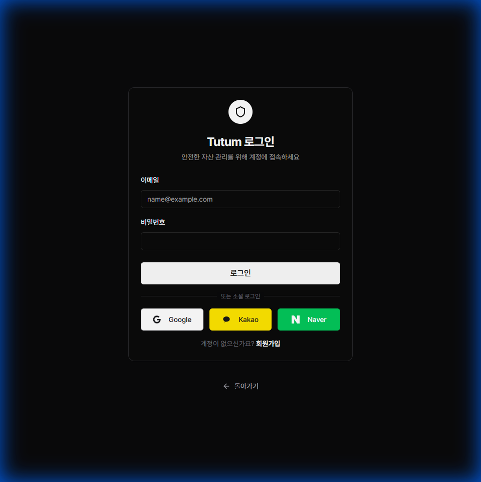
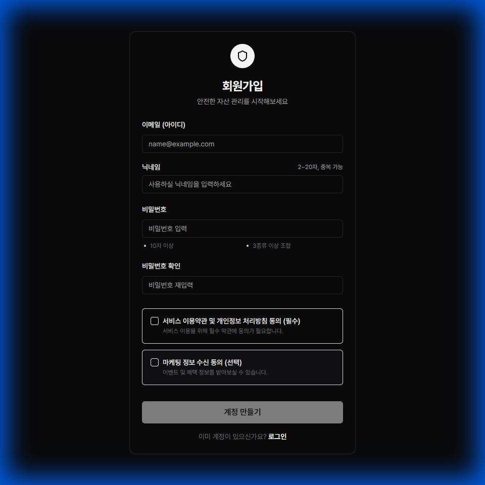

# 📝 Dev Logs 작성 가이드

## 목적
모든 팀원이 작업 내용을 체계적으로 문서화하여 협업 효율성을 높이고, UI 변경 사항을 시각적으로 추적합니다.

---

## 📋 작성 규칙

### 1. **작성 시점**
-   **Push/Merge 전 필수**: 코드 변경이 포함된 모든 push 또는 merge 전에 dev_log를 반드시 작성해야 합니다.
-   **PR 생성 전 필수**: dev_log가 없는 PR은 리뷰 대상에서 제외됩니다.
-   **일자별 작성**: `YYYY-MM-DD_작업내용.md` 형식으로 파일명을 지정합니다.
    -   예: `2026-02-03_portfolio_asset_fixes.md`

> **[MANDATORY]** dev_log 미작성 시 해당 push/merge는 무효 처리되며, 작성 후 재push해야 합니다.

### 2. **파일 위치**
```
docs/dev_logs/
├── YYYY-MM-DD_작업내용.md
└── screenshots/
    └── YYYY-MM-DD/
        ├── 스크린샷1.png
        └── 스크린샷2.png
```

### 3. **필수 포함 항목**
모든 dev_log는 다음 섹션을 포함해야 합니다:

```markdown
# 📅 개발 작업 완료 보고서 (YYYY-MM-DD)

## 📌 작업 개요
**작성자**: `브랜치를 생성/작업한 팀원의 Git Username` (예: kyk02405, jhnet00 등) ※ AI 도구명(antigravity, claude 등)이 아닌 실제 작업자 본인의 이름을 기재
**Jira Ticket**: `TICKET-ID` (있는 경우)
**Branch**: `feature/branch-name`
**작업 내용**: 한 줄 요약

## 1. 🔧 주요 변경 사항
-   변경된 파일 및 기능 설명
-   추가/수정/삭제된 로직

## 2. 🐛 버그 수정 (있는 경우)
-   문제 상황
-   원인 분석
-   해결 방법

## 3. 📸 UI 스크린샷 (브라우징 기능 사용 가능한 경우 필수)
### 페이지/컴포넌트 이름


## 4. 📝 커밋 내역
```
git log --oneline --since="YYYY-MM-DD" --until="YYYY-MM-DD 23:59:59"
```

---
**✅ 결론**: 작업 완료 후 핵심 성과 요약
```

---

## 📸 UI 스크린샷 가이드

### **UI 변경이 있는 경우, 브라우징/캡처 기능 사용이 가능한 환경(Antigravity 등)에서는 스크린샷 포함이 필수입니다.**
> [!NOTE]
> VS Code 등을 사용하여 수동으로 작업하는 팀원의 경우, 수동 스크린샷 캡처 및 첨부를 권장하지만 필수는 아닙니다. 단, AI 도구를 사용하는 경우에는 반드시 시각적 증거를 남겨야 합니다.

### 1. **스크린샷 캡처 방법**

#### 방법 A: 브라우저 개발자 도구 사용
1.  로컬 서버 실행 (`npm run dev`)
2.  변경된 페이지로 이동
3.  `F12` → 개발자 도구 → 스크린샷 캡처
4.  `docs/dev_logs/screenshots/YYYY-MM-DD/` 폴더에 저장

#### 방법 B: Antigravity 브라우징 기능 사용 (권장)
```
브라우징 기능을 사용해서 [페이지명] 캡처해줘
```
-   예: "브라우징 기능을 사용해서 로그인 페이지 캡처해줘"
-   AI가 자동으로 스크린샷을 캡처하고 적절한 위치에 저장합니다.

### 2. **스크린샷 파일명 규칙**
-   **영문 소문자 + 언더스코어** 사용
-   **의미 있는 이름** 사용
-   예시:
    -   `login_page.png`
    -   `portfolio_asset_modal.png`
    -   `market_section.png`

### 3. **스크린샷 포함 예시**
```markdown
## 3. 📸 UI 스크린샷

### 로그인 페이지 (Login Page)


### 회원가입 페이지 (Registration Page)

```

---

## ✅ 체크리스트

Push/Merge 전에 다음 항목을 **반드시** 확인하세요:

-   [ ] `docs/dev_logs/YYYY-MM-DD_작업내용.md` 파일 생성 완료
-   [ ] 작업 개요(작성자, 브랜치, 작업 내용) 작성 완료
-   [ ] 주요 변경 사항 및 변경 파일 목록 작성 완료
-   [ ] 결론(핵심 성과 요약) 작성 완료
-   [ ] UI 변경이 있는 경우 스크린샷 캡처 및 포함
-   [ ] 스크린샷 파일이 `docs/dev_logs/screenshots/YYYY-MM-DD/` 폴더에 저장됨
-   [ ] dev_log 파일이 **커밋에 포함**되어 있음
-   [ ] 커밋 메시지가 명확하고 구체적임
-   [ ] PR 설명에 dev_log 파일 링크 포함

---

## 🚨 필수 준수 사항 (Push/Merge 전 의무)

> **이 규칙은 모든 팀원에게 예외 없이 적용됩니다.**

### Push 전 필수 프로세스
```
1. 코드 작업 완료
2. dev_log 작성 (docs/dev_logs/YYYY-MM-DD_작업내용.md)
3. dev_log 파일을 커밋에 포함
4. Push 실행
```

### Merge 전 필수 프로세스
```
1. 브랜치의 모든 작업에 대한 dev_log 존재 확인
2. dev_log에 변경 파일 목록 및 작업 요약 포함 확인
3. PR 본문에 dev_log 파일 경로 명시
4. Merge 실행
```

### 위반 시 조치
-   dev_log 없이 push된 커밋은 리뷰어가 **revert 요청** 가능
-   dev_log 없는 PR은 **리뷰 거부** 대상
-   반복 위반 시 팀 회의에서 공유

### dev_log 작성이 필요 없는 경우 (예외)
-   설정 파일만 변경한 경우 (`.gitignore`, `eslint` 등)
-   의존성 업데이트만 수행한 경우 (`package.json`, `requirements.txt`)
-   README/문서 오타 수정 등 단순 수정

> 위 예외 사항에 해당하더라도, 판단이 애매한 경우에는 작성하는 것을 원칙으로 합니다.

---

## 🚫 금지 사항

-   ❌ **스크린샷 없이 UI 변경 사항 Push 금지**
-   ❌ **"fix stuff", "update" 같은 모호한 커밋 메시지 금지**
-   ❌ **dev_log 없이 PR 생성 금지**
-   ❌ **dev_log 없이 코드 변경 Push 금지**
-   ❌ **dev_log 없이 브랜치 Merge 금지**
-   ❌ **스크린샷을 임의의 위치에 저장 금지** (반드시 `screenshots/YYYY-MM-DD/` 사용)

---

## 📚 참고 예시

-   [2026-01-27_ui_integration.md](2026-01-27_ui_integration.md)
-   [2026-02-02_auth_fixes.md](2026-02-02_auth_fixes.md)
-   [2026-02-03_screenshot_documentation.md](2026-02-03_screenshot_documentation.md)

---

**✅ 이 가이드를 따르면 팀 전체가 작업 내용을 명확하게 이해하고, UI 변경 사항을 시각적으로 추적할 수 있습니다.**
