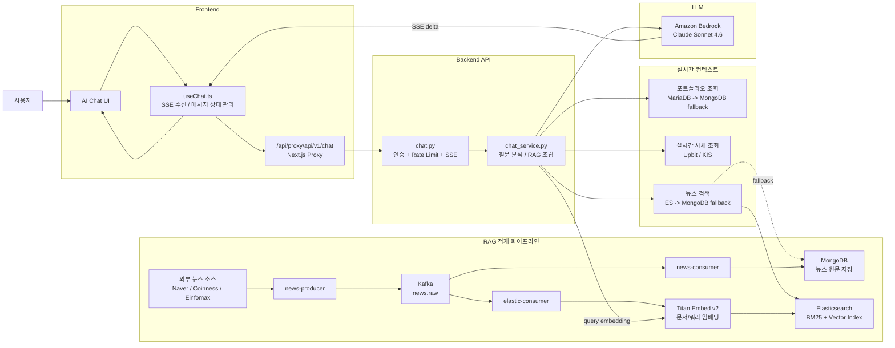
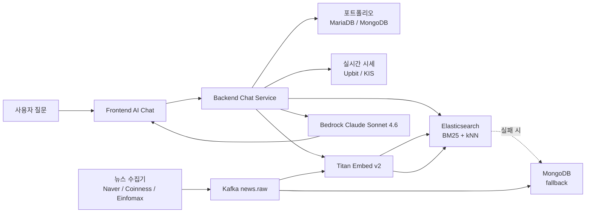

# TUTUM 챗봇 RAG 파이프라인 아키텍처

- 작성일: `2026-03-17`
- 범위: 현재 staging 기준 `AI 챗봇 질의 흐름 + 뉴스 적재/RAG 인덱싱 흐름`
- 목적: 발표 자료, draw.io, PPT, Notion에 바로 옮길 수 있도록 TUTUM 챗봇 파이프라인을 실제 코드 기준으로 정리
- 소스 오브 트루스:
  - `backend/app/routers/chat.py`
  - `backend/app/services/chat_service.py`
  - `backend/workers/producer_news.py`
  - `backend/workers/consumer_news.py`
  - `backend/workers/elastic_consumer.py`
  - `frontend/frontend/hooks/useChat.ts`
  - `frontend/frontend/app/api/proxy/[...path]/route.ts`

---

## 1. 한 줄 요약

TUTUM 챗봇은 `사용자 질문 -> Frontend AI UI -> Frontend proxy -> Backend chat service -> 시세/포트폴리오/뉴스 RAG 조회 -> Amazon Bedrock Claude 스트리밍 응답` 구조로 동작하며, 뉴스 RAG 코퍼스는 `뉴스 크롤링 -> Kafka -> MongoDB + Elasticsearch(+Titan 임베딩)` 파이프라인으로 적재됩니다.

---

## 2. 전체 구조 요약

이 구조는 크게 2개의 레인으로 보면 가장 이해하기 쉽습니다.

1. 사용자 응답 레인
   - 사용자가 AI 채팅창에서 질문
   - Frontend가 SSE로 Backend chat API 호출
   - Backend가 포트폴리오, 시세, 뉴스 컨텍스트를 모아 Bedrock Claude에 전달
   - 응답을 `start / sources / delta / done` 이벤트로 스트리밍 반환

2. 지식 적재 레인
   - 뉴스 producer가 외부 뉴스 소스를 수집
   - Kafka `news.raw`로 발행
   - `news-consumer`가 MongoDB에 저장
   - `elastic-consumer`가 Elasticsearch에 인덱싱하고 Titan 임베딩 생성
   - 챗봇이 이 인덱스를 BM25 + kNN 하이브리드 검색에 사용

---

## 3. 발표용 핵심 문장

발표에서는 아래 문장으로 설명하면 자연스럽습니다.

> 저희 챗봇은 단순히 LLM에 질문을 보내는 구조가 아니라, 사용자 질문을 받으면 먼저 포트폴리오, 실시간 시세, 그리고 사전에 수집해 둔 뉴스 데이터를 함께 조회합니다. 뉴스는 Kafka 기반 파이프라인으로 MongoDB와 Elasticsearch에 적재되고, Elasticsearch에는 Titan 임베딩까지 생성해 두어서 BM25와 벡터 검색을 함께 사용합니다. 이렇게 모은 컨텍스트를 Bedrock Claude에 전달해 근거 기반의 응답을 스트리밍으로 반환합니다.

---

## 4. 구성 요소

## 4-1. 사용자 질의 처리 구성

| 계층 | 컴포넌트 | 역할 |
|---|---|---|
| UI | `frontend AI chat UI` | 사용자 질문 입력, 답변 표시 |
| Frontend hook | `useChat.ts` | SSE 수신, 메시지 상태 관리, sessionStorage 유지 |
| Frontend proxy | `/api/proxy/[...path]/route.ts` | 브라우저 요청을 backend/ocr 등 내부 서비스로 중계 |
| API router | `backend/app/routers/chat.py` | 인증, rate limit, SSE/JSON chat endpoint 제공 |
| Core service | `backend/app/services/chat_service.py` | 질문 분석, RAG 조회, 컨텍스트 조립, Bedrock 호출 |
| LLM | `Amazon Bedrock Claude Sonnet 4.6` | 최종 자연어 응답 생성 |

## 4-2. RAG 적재 구성

| 단계 | 컴포넌트 | 역할 |
|---|---|---|
| 수집 | `producer_news.py` | Naver Finance, Coinness, Einfomax 수집 |
| 이벤트 버스 | `Kafka topic: news.raw` | 뉴스 이벤트 전달 |
| 문서 저장 | `consumer_news.py` | MongoDB upsert 저장 |
| 검색 저장 | `elastic_consumer.py` | Elasticsearch upsert + Titan 임베딩 생성 |
| 문서 저장소 | `MongoDB` | 원문/본문/메타 저장, fallback 검색 |
| 검색 인덱스 | `Elasticsearch` | BM25 + vector search 인덱스 |
| 임베딩 모델 | `Amazon Titan Embed Text v2` | 문서 임베딩, 쿼리 임베딩 생성 |

## 4-3. 질의 시 추가 컨텍스트

| 데이터 | 조회 위치 | 용도 |
|---|---|---|
| 포트폴리오 | `MariaDB -> MongoDB fallback` | 사용자 보유 자산 기반 분석 |
| 실시간 시세(코인) | `Upbit client` | 코인 질문 가격 컨텍스트 |
| 실시간 시세(주식/ETF) | `KIS client` | 주식/ETF 질문 가격 컨텍스트 |
| 뉴스 RAG | `Elasticsearch -> MongoDB fallback` | 최신 뉴스 근거 제공 |

---

## 5. 실제 사용자 질의 흐름

## 5-1. 단계별 흐름

1. 사용자가 AI 채팅창에서 질문 입력
2. `frontend/useChat.ts`가 `/api/proxy/api/v1/chat`로 `POST` 요청 전송
3. Frontend proxy가 backend chat API로 중계
4. `chat.py`가 인증 사용자 확인 및 rate limit 적용
5. `chat_service.chat_stream()` 실행
6. 질문에서 코인 티커, 주식/ETF 심볼, 키워드 추출
7. 필요 시 사용자 포트폴리오 조회
   - 우선 `MariaDB`
   - 실패 시 `MongoDB assets`
8. 실시간 시세 조회
   - 코인: `Upbit`
   - 주식/ETF: `KIS`
9. 뉴스 조회
   - 우선 `Elasticsearch`
   - 실패 또는 결과 없음 시 `MongoDB fallback`
10. 포트폴리오 + 시세 + 뉴스를 하나의 프롬프트 컨텍스트로 조합
11. `Bedrock Claude Sonnet 4.6`에 전달
12. 응답을 SSE로 스트리밍 반환
   - `start`
   - `sources`
   - `delta`
   - `done`
13. Frontend가 응답을 점진적으로 화면에 렌더링

## 5-2. 현재 구현 특징

- 질문 의도가 명확한 종목 질문이면 포트폴리오 키워드를 무조건 섞지 않음
- 최근 `14일` 뉴스가 우선 검색되고, 없으면 더 오래된 문서로 fallback
- ES 검색은 `BM25 60% + kNN 40%` 하이브리드
- 쿼리 임베딩도 `Titan Embed v2`로 생성
- ES 실패 시 MongoDB 텍스트 검색으로 자동 fallback
- Bedrock 실패 시 mock/fallback 응답으로 완전 중단을 피함

---

## 6. 뉴스 적재 및 RAG 인덱싱 흐름

## 6-1. 단계별 흐름

1. `news-producer`가 외부 뉴스 소스를 주기적으로 수집
   - `Naver Finance`
   - `Coinness`
   - `Einfomax`
2. 중복 링크 제거와 시간 정렬 수행
3. Kafka `news.raw` 토픽으로 뉴스 이벤트 발행
4. `news-consumer`가 Kafka를 consume
5. MongoDB `news` 컬렉션에 URL 기준 upsert 저장
6. `elastic-consumer`가 같은 Kafka 토픽을 consume
7. Elasticsearch용 문서 스키마로 normalize
8. `ENABLE_BEDROCK_EMBEDDING=true`면 Titan 임베딩 생성
9. Elasticsearch `news` 인덱스에 `doc_as_upsert` 방식으로 저장
10. 챗봇은 이 인덱스를 질의 시 검색에 사용

## 6-2. 적재되는 핵심 필드

| 저장소 | 핵심 필드 |
|---|---|
| MongoDB | `url`, `title`, `content/body`, `published_at`, `source`, `summary` |
| Elasticsearch | `url`, `title`, `content`, `summary`, `source`, `published_at`, `embedding` |

## 6-3. 임베딩 정보

| 항목 | 값 |
|---|---|
| 모델 | `amazon.titan-embed-text-v2:0` |
| 차원 수 | `1024` |
| 문서 입력 | `title + summary + content` 최대 8000자 |
| 쿼리 입력 | 확장된 검색 키워드 문자열 |
| 유사도 | `cosine` |

---

## 7. 메인 다이어그램 (발표/이미지용)

아래 Mermaid는 draw.io, Mermaid Live, GitHub Markdown에 바로 붙여 사용할 수 있습니다.

---

## 8. 단순 발표 버전 다이어그램

발표 자료에서 너무 복잡하면 아래 버전으로 줄여서 써도 됩니다.

---

## 9. draw.io 배치 가이드

## 9-1. 가장 추천하는 배치

왼쪽에서 오른쪽으로 5개 컬럼으로 나누면 가장 보기 좋습니다.

1. `User`
2. `Frontend`
3. `Backend Chat Service`
4. `Context / Retrieval`
5. `LLM / Data Pipeline`

## 9-2. 상단 레인

상단은 사용자 질의 처리 레인으로 배치합니다.

- `User`
- `AI Chat UI`
- `Next.js Proxy`
- `chat.py`
- `chat_service.py`
- `Portfolio / Price / ES Retrieval`
- `Bedrock Claude`

## 9-3. 하단 레인

하단은 데이터 적재 레인으로 배치합니다.

- `Naver / Coinness / Einfomax`
- `news-producer`
- `Kafka news.raw`
- `news-consumer -> MongoDB`
- `elastic-consumer -> Titan Embed -> Elasticsearch`

## 9-4. 선 색 추천

- 사용자 요청/응답: 파란색 실선
- 데이터 적재(Kafka): 보라색 실선
- fallback 경로: 회색 점선
- LLM 호출: 주황색 점선
- 임베딩 경로: 초록색 실선

## 9-5. 강조해야 할 포인트

- `ES 검색 + Mongo fallback`
- `Bedrock Claude 응답`
- `Titan 임베딩`
- `Kafka 기반 뉴스 적재`
- `포트폴리오/시세/뉴스를 함께 쓰는 RAG`

---

## 10. 아이콘 매핑 가이드

이미지로 뽑을 때 아이콘은 아래처럼 쓰는 것이 가장 자연스럽습니다.

| 영역 | 권장 아이콘 |
|---|---|
| Frontend | Next.js 또는 채팅 UI 아이콘 |
| Backend | FastAPI 또는 API 박스 |
| Kafka | Apache Kafka 로고 |
| MongoDB | MongoDB 로고 |
| Elasticsearch | Elasticsearch / OpenSearch 스타일 로고 |
| Titan | Bedrock / embedding 박스 |
| Claude | Amazon Bedrock 로고 |
| Portfolio DB | MariaDB 로고 |
| Price API | Upbit / KIS 로고 |
| 뉴스 소스 | Naver / Coinness / Einfomax 로고 또는 텍스트 박스 |

아이콘이 애매한 경우:

- `chat_service.py`
- `news-consumer`
- `elastic-consumer`
- `internal proxy`
- `fallback`

위 항목은 아이콘보다 `rounded box + 텍스트`가 더 낫습니다.

---

## 11. 발표용 멘트 예시

### 짧은 버전

> 사용자가 질문을 하면 프론트가 백엔드 챗봇 서비스로 요청을 보내고, 백엔드는 먼저 사용자 포트폴리오, 실시간 시세, 그리고 뉴스 인덱스를 조회합니다. 뉴스는 미리 Kafka 파이프라인으로 MongoDB와 Elasticsearch에 적재돼 있고, Elasticsearch에는 Titan 임베딩이 생성돼 있어서 BM25와 벡터 검색을 함께 쓸 수 있습니다. 이렇게 모은 컨텍스트를 Bedrock Claude에 전달해서 근거 기반 응답을 스트리밍으로 반환합니다.

### 조금 더 자세한 버전

> 저희 챗봇 파이프라인은 크게 두 부분입니다. 첫 번째는 사용자 질의 응답 흐름이고, 두 번째는 뉴스 적재 및 RAG 인덱싱 흐름입니다. 사용자가 질문하면 프론트의 AI 채팅 UI가 Next.js proxy를 통해 backend chat service를 호출합니다. backend는 질문에서 종목과 키워드를 추출하고, 포트폴리오는 MariaDB 우선, 실패 시 MongoDB fallback으로 조회합니다. 시세는 Upbit와 KIS에서 가져오고, 뉴스는 Elasticsearch를 먼저 검색하되 결과가 없으면 MongoDB로 fallback합니다. Elasticsearch 검색은 BM25와 Titan 기반 벡터 검색을 함께 사용합니다. 이 컨텍스트를 Bedrock Claude에 전달하고, 응답은 SSE 스트리밍으로 프론트에 전달됩니다. 한편 뉴스 데이터는 별도 producer가 외부 소스를 수집해 Kafka에 넣고, consumer가 MongoDB와 Elasticsearch에 각각 저장해 챗봇이 최신 정보를 활용할 수 있도록 합니다.

---

## 12. 아키텍처 참고 메모

- 현재 구조에는 `API Gateway`, `Lambda`, `S3 문서 적재형 RAG`는 메인 경로에 없습니다.
- 즉, 예시 이미지처럼 `API Gateway -> Lambda -> Bedrock` 구조가 아니라, 실제 구현은 `Frontend Proxy -> FastAPI chat_service -> Bedrock` 구조입니다.
- 문서 저장은 `MongoDB`, 검색/벡터 검색은 `Elasticsearch`, 이벤트 파이프라인은 `Kafka`가 핵심입니다.
- 챗봇은 `질문 시점 실시간 시세`와 `사전 적재된 뉴스 인덱스`를 함께 사용하는 하이브리드 구조입니다.
- 발표 자료에서는 `응답 레인`과 `적재 레인`을 분리해 보여주는 것이 가장 이해하기 쉽습니다.
