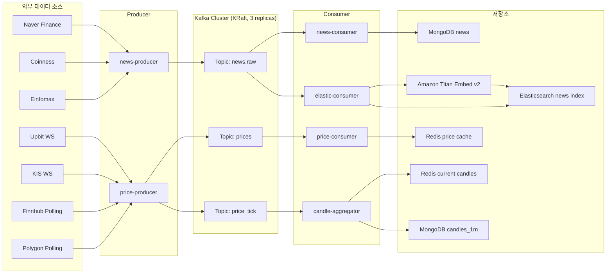
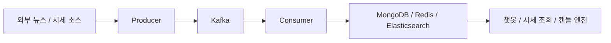

# TUTUM Kafka Pipeline Architecture

작성일: 2026-03-17  
기준 환경: AWS Staging / EKS  
문서 목적: TUTUM 서비스에서 Kafka가 어떤 역할로 사용되고 있는지 발표 자료와 아키텍처 이미지로 바로 옮길 수 있도록 정리한다.

## 1. 한 줄 요약

TUTUM의 Kafka는 `뉴스 수집/색인 파이프라인`과 `실시간 시세/캔들 파이프라인`의 중앙 이벤트 버스로 사용되며, 생산자와 소비자를 느슨하게 분리하고 KEDA 기반 오토스케일링까지 연결하는 핵심 메시징 계층이다.

## 2. 전체 역할 요약

- `뉴스 레인`
  - 외부 뉴스 소스를 수집
  - Kafka `news.raw` 토픽에 적재
  - MongoDB에는 원문 저장
  - Elasticsearch에는 검색용 인덱싱 및 벡터 검색용 문서 저장

- `시세 레인`
  - Upbit, KIS 등 외부 시세 소스에서 실시간 가격 수집
  - Kafka `prices`, `price_tick` 토픽에 적재
  - Redis에는 최신 가격 캐시 저장
  - MongoDB에는 최종 캔들 저장

## 3. 핵심 구성 요소

### 3-1. Kafka 클러스터

- 위치: `tutum-data` namespace
- 형태: `Kafka KRaft cluster`
- replica: `3`
- 역할:
  - 뉴스 이벤트 버스
  - 실시간 가격 이벤트 버스
  - 소비자 확장과 생산자 처리를 분리하는 완충 계층

### 3-2. 주요 Producer

- `news-producer`
  - 외부 뉴스 크롤링 결과를 Kafka로 전송
- `price-producer`
  - Upbit/KIS/Finnhub/Polygon 기반 가격 데이터를 Kafka로 전송

### 3-3. 주요 Consumer

- `news-consumer`
  - 뉴스 원문을 MongoDB에 저장
- `elastic-consumer`
  - 뉴스 문서를 Elasticsearch에 색인
  - 필요 시 Amazon Titan 임베딩 생성
- `price-consumer`
  - 최신 가격을 Redis에 캐시
- `candle-aggregator`
  - tick 데이터를 모아 1분봉 캔들 생성
  - 진행 중 캔들은 Redis, 확정 캔들은 MongoDB 저장

## 4. 토픽 설계

| 토픽 | Producer | Consumer | 목적 |
|---|---|---|---|
| `news.raw` | `news-producer` | `news-consumer`, `elastic-consumer` | 뉴스 원문 이벤트 전달 |
| `prices` | `price-producer` | `price-consumer` | 최신 가격 캐시 업데이트 |
| `price_tick` | `price-producer` | `candle-aggregator` | 틱 단위 시세 기반 캔들 생성 |

## 5. 뉴스 Kafka 파이프라인

### 5-1. 흐름

1. `news-producer`가 외부 뉴스 소스를 수집한다.
2. 정규화한 기사 데이터를 Kafka `news.raw` 토픽에 발행한다.
3. `news-consumer`가 `news.raw`를 구독해 MongoDB `news` 컬렉션에 upsert한다.
4. `elastic-consumer`가 같은 `news.raw`를 구독해 Elasticsearch `news` 인덱스에 색인한다.
5. 임베딩이 필요한 경우 Amazon Titan Embed v2를 호출해 벡터 필드까지 저장한다.
6. 이후 챗봇 RAG가 Elasticsearch 검색과 MongoDB fallback으로 이 데이터를 활용한다.

### 5-2. 외부 뉴스 소스

- Naver Finance
- Coinness
- Einfomax

### 5-3. 저장소 역할 분리

- `MongoDB`
  - 뉴스 원문 저장소
  - fallback 조회
- `Elasticsearch`
  - 키워드 검색
  - BM25 + 벡터 검색 기반 RAG 조회

## 6. 시세 Kafka 파이프라인

### 6-1. 흐름

1. `price-producer`가 Upbit WebSocket, KIS WebSocket, 보조 폴링 소스를 통해 가격 데이터를 수집한다.
2. 동일한 틱 이벤트를 Kafka `prices`와 `price_tick`에 각각 발행한다.
3. `price-consumer`는 `prices`를 소비해 Redis `price:{symbol}` 캐시를 갱신한다.
4. `candle-aggregator`는 `price_tick`을 소비해 틱을 분 단위로 집계한다.
5. 진행 중인 1분봉은 Redis에 저장되고, 마감된 1분봉은 MongoDB `candles_1m` 컬렉션에 저장된다.

### 6-2. 외부 시세 소스

- Upbit WebSocket
- Korea Investment & Securities WebSocket
- Finnhub polling fallback
- Polygon polling fallback

### 6-3. 저장소 역할 분리

- `Redis`
  - 최신 가격 캐시
  - 진행 중 캔들 캐시
- `MongoDB`
  - 확정된 캔들 데이터 저장

## 7. KEDA 기반 오토스케일링

Kafka lag를 기준으로 일부 consumer 워크로드가 자동 확장된다.

| 워크로드 | 토픽 | 기준 | 최소 | 최대 |
|---|---|---|---|---|
| `price-consumer` | `prices` | lag `50` | `1` | `5` |
| `news-consumer` | `news.raw` | lag `30` | `1` | `4` |
| `elastic-consumer` | `news.raw` | lag `30` | `1` | `3` |

의미:

- 뉴스가 갑자기 많이 들어오면 MongoDB 저장과 Elasticsearch 색인이 각각 독립적으로 확장된다.
- 시세 트래픽이 급증하면 가격 캐시 갱신 consumer가 먼저 확장된다.
- Kafka를 중심에 둔 덕분에 producer 속도와 consumer 처리량을 분리해서 운영할 수 있다.

## 8. 운영 관점에서의 장점

- Producer와 Consumer가 직접 결합되지 않아 장애 격리가 쉽다.
- 트래픽 급증 시 consumer만 증설할 수 있어 비용 효율이 좋다.
- 뉴스 저장과 색인을 분리해 검색 장애가 원문 수집까지 바로 전파되지 않는다.
- 가격 캐시와 캔들 생성 파이프라인을 분리해 실시간 조회와 집계 로직을 독립적으로 운영할 수 있다.
- Kafka lag를 통해 운영자가 병목 지점을 빠르게 파악할 수 있다.

## 9. 현재 구조의 한계와 주의점

- 이메일 워커는 현재 Kafka 기반이 아니라 별도 워커 흐름이므로 이 구조도에 포함하지 않는 것이 정확하다.
- `price_tick`과 `prices` 토픽이 동시에 존재하므로 발표 때는 `최신 가격용`과 `캔들 집계용`으로 역할을 분리해서 설명해야 이해가 쉽다.
- 뉴스 파이프라인의 최종 품질은 외부 크롤링 품질과 Elasticsearch 색인 상태에 영향을 받는다.
- Kafka는 핵심 메시징 계층이지만, 최종 서비스 응답은 Redis, MongoDB, Elasticsearch, Bedrock 등 다른 계층과 함께 봐야 한다.

## 10. 발표용 메인 다이어그램

## 11. 발표용 단순 버전

## 12. draw.io 배치 가이드

### 12-1. 추천 박스 구성

- 왼쪽: `External Sources`
- 중앙 상단: `Producer`
- 중앙: `Kafka Cluster`
- 중앙 하단: `Consumer`
- 오른쪽: `Storage`
- 맨 오른쪽 또는 하단: `Service Usage`

### 12-2. 색상 추천

- 외부 소스: 회색 또는 연한 파랑
- Producer: 보라
- Kafka: 검정 또는 진한 회색
- Consumer: 보라 또는 파랑
- 저장소:
  - MongoDB: 초록
  - Redis: 빨강
  - Elasticsearch: 노랑/청록
- AI/Embedding: 청록

### 12-3. 선 스타일 추천

- 실선: 실제 데이터 흐름
- 점선: 부가 설명 또는 활용 경로
- 색상 분리:
  - 뉴스 레인: 보라
  - 시세 레인: 파랑 또는 초록

## 13. 아이콘 매핑 가이드

### 13-1. 권장 아이콘

- Kafka: Apache Kafka 로고
- MongoDB: MongoDB 로고
- Redis: Redis 로고
- Elasticsearch: Elastic 로고
- Amazon Titan: Bedrock 또는 AI 계열 아이콘
- Upbit / KIS / Naver Finance / Coinness: 서비스 로고가 있으면 사용, 없으면 텍스트 박스

### 13-2. 텍스트만으로 충분한 항목

- `news-producer`
- `news-consumer`
- `elastic-consumer`
- `price-producer`
- `price-consumer`
- `candle-aggregator`
- `news.raw`
- `prices`
- `price_tick`

## 14. 발표용 설명 멘트 예시

### 14-1. 짧은 버전

저희 서비스에서 Kafka는 뉴스와 실시간 시세를 처리하는 중앙 이벤트 버스입니다. 뉴스는 외부 소스에서 수집한 뒤 Kafka로 보내고, MongoDB 원문 저장과 Elasticsearch 검색 색인을 각각 별도 consumer가 처리합니다. 시세도 Kafka를 통해 최신 가격 캐시와 캔들 집계가 분리되어 처리되며, consumer는 Kafka lag 기준으로 KEDA가 자동 확장합니다.

### 14-2. 자세한 버전

저희 Kafka 파이프라인은 크게 뉴스 레인과 시세 레인으로 나뉩니다. 뉴스 레인에서는 news-producer가 Naver Finance, Coinness, Einfomax에서 기사를 수집해 `news.raw` 토픽에 적재합니다. 이후 news-consumer는 MongoDB에 원문을 저장하고, elastic-consumer는 Elasticsearch에 색인하면서 필요하면 Titan 임베딩도 생성합니다. 시세 레인에서는 price-producer가 Upbit와 KIS 등에서 실시간 가격을 받아 `prices`와 `price_tick` 두 토픽에 발행합니다. price-consumer는 최신 가격을 Redis에 저장하고, candle-aggregator는 tick을 모아 분봉을 만들어 Redis와 MongoDB에 나눠 저장합니다. 이 구조 덕분에 생산과 소비를 분리할 수 있고, Kafka lag를 기반으로 consumer를 자동 확장해 트래픽 증가에도 안정적으로 대응할 수 있습니다.

