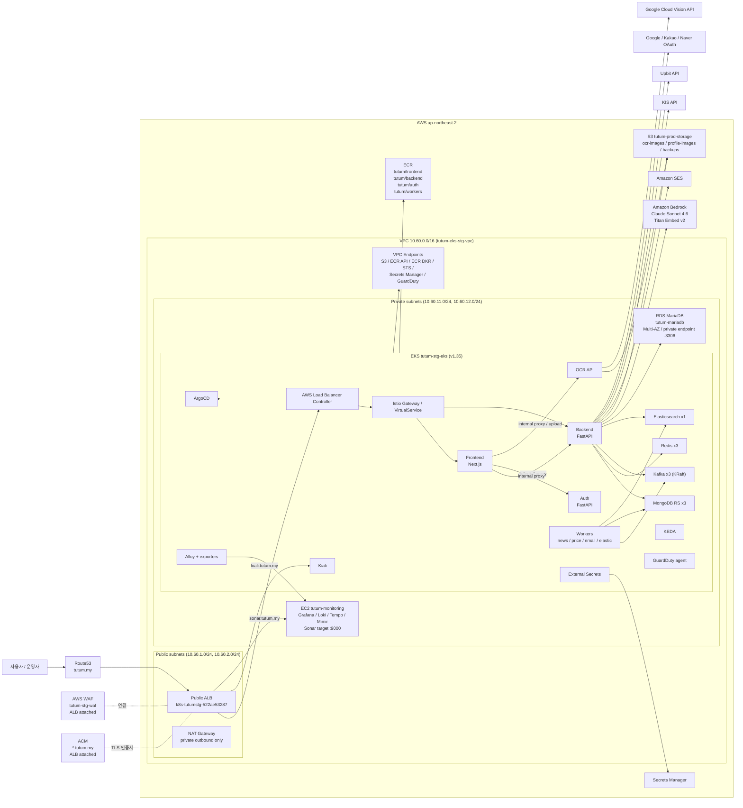

# TUTUM AWS Staging 토폴로지 아키텍처

- 작성일: `2026-03-16`
- 범위: `ap-northeast-2` 리전에 실제로 운영 중인 staging 인프라
- 목적: 현재 AWS 토폴로지, 실사용 기술 스택, 그리고 `draw.io`나 발표 자료에 바로 옮길 수 있는 아키텍처 설계도를 정리

---

## 1. 요약

`2026-03-16` 기준 TUTUM staging은 프라이빗 서브넷 중심의 AWS 아키텍처로 운영되고 있습니다.

- 인터넷 트래픽은 `Route53 -> ALB` 경로로 유입되며, `ACM` 인증서와 `WAF`는 ALB에 부착된 형태로 동작합니다.
- 핵심 애플리케이션 워크로드는 `EKS (tutum-stg-eks)` 위에서 동작합니다.
- 애플리케이션 계층은 `Next.js + FastAPI + Auth FastAPI + OCR + Kafka workers`로 구성됩니다.
- 데이터 계층은 대부분 클러스터 내부에 있으며 `MongoDB ReplicaSet`, `Redis`, `Kafka`, `Elasticsearch`를 사용합니다.
- 계정 및 포트폴리오 같은 관계형 데이터는 `RDS MariaDB (tutum-mariadb)`를 사용합니다.
- AI는 `Amazon Bedrock Claude Sonnet 4.6`과 `Titan Embed v2`를 사용합니다.
- 관측 시스템은 이중 구조입니다.
  - 클러스터 내부 수집기와 익스포터: `Grafana Alloy`, `node-exporter`, `kafka-exporter`, `redis-exporter`, `elasticsearch-exporter`
  - 외부 모니터링 VM: `tutum-monitoring`의 `Grafana / Loki / Tempo / Mimir`
- `SonarQube`는 클러스터 내부 파드로 동작하지 않고, 현재는 ALB를 통해 프라이빗 모니터링 EC2 경로를 바라봅니다.
- 객체 저장소와 백업은 `S3 tutum-prod-storage`를 사용합니다.

즉, 이 구조는 "모든 것이 EKS 안에 있다"라고 그리면 안 되고, 실제 모습은 아래처럼 이해하는 것이 맞습니다.

1. 엣지와 보안은 AWS 관리형 서비스
2. 앱과 데이터는 대부분 EKS 내부
3. 모니터링과 Sonar는 일부 별도 EC2
4. AI, 시크릿, 스토리지, 레지스트리, 메일, DB는 외부 관리형 서비스

---

## 2. AWS 리소스 인벤토리

## 2-1. 네트워크와 엣지

| 구분 | 현재 리소스 | 값 / 이름 | 비고 |
|---|---|---|---|
| 리전 | AWS Region | `ap-northeast-2` | 서울 |
| VPC | VPC | `tutum-eks-stg-vpc` | CIDR `10.60.0.0/16` |
| Public subnet A | Subnet | `10.60.1.0/24` | `ap-northeast-2a` |
| Public subnet C | Subnet | `10.60.2.0/24` | `ap-northeast-2c` |
| Private subnet A | Subnet | `10.60.11.0/24` | `ap-northeast-2a` |
| Private subnet C | Subnet | `10.60.12.0/24` | `ap-northeast-2c` |
| 인터넷 아웃바운드 | NAT Gateway | `nat-02d4de6a0d9b1cd72` | Public subnet A에 1개, private subnet 워크로드의 outbound 전용 |
| 인터넷 인바운드 | ALB | `k8s-tutumstg-522ae53287` | internet-facing |
| DNS | Route53 Hosted Zone | `tutum.my` | public hosted zone |
| TLS | ACM certificate | `*.tutum.my`, `tutum.my` | 상태 `ISSUED` |
| 엣지 보호 | WAF | `tutum-stg-waf` | ALB에 연결 |

## 2-2. VPC 엔드포인트

| 타입 | 서비스 |
|---|---|
| Gateway | `S3` |
| Interface | `ECR API` |
| Interface | `ECR DKR` |
| Interface | `STS` |
| Interface | `Secrets Manager` |
| Interface | `GuardDuty data` |

## 2-3. 컴퓨트와 플랫폼

| 구분 | 현재 리소스 | 값 / 이름 | 비고 |
|---|---|---|---|
| Kubernetes | EKS cluster | `tutum-stg-eks` | version `1.35` |
| Service CIDR | EKS networking | `172.20.0.0/16` | cluster service CIDR |
| Worker OS | EKS nodes | `Bottlerocket` | EKS Auto Mode 관리 노드 |
| 현재 워커 수 | Node count | `11` | 캡처 시점 기준 |
| NodePool | `system` | `1` node | control/platform workloads |
| NodePool | `private-system` | `1` node | platform workloads |
| NodePool | `private-app` | `2` nodes | app workloads |
| NodePool | `private-ci` | `1` node | CI workloads |
| NodePool | `private-data` | `6` nodes | data workloads |
| NodePool | `general-purpose` | `0` nodes | 구성은 되어 있으나 현재 미사용 |
| Monitoring VM | EC2 | `tutum-monitoring` | `m5.large`, private IP `10.60.11.95` |

## 2-4. 관리형 서비스

| 구분 | 현재 리소스 | 값 / 이름 | 비고 |
|---|---|---|---|
| 레지스트리 | ECR | `tutum/frontend`, `tutum/backend`, `tutum/auth`, `tutum/workers` | public/utility repo 일부도 mirror 또는 pull |
| 관계형 DB | RDS MariaDB | `tutum-mariadb` | `db.t3.micro`, `Multi-AZ`, private endpoint `tutum-mariadb.cfoeqgoysp2f.ap-northeast-2.rds.amazonaws.com:3306`, engine `10.11.15` |
| 시크릿 | Secrets Manager | active | External Secrets로 클러스터 동기화 |
| 객체 저장소 | S3 | `tutum-prod-storage` | 앱 파일 및 백업 |
| AI 런타임 | Bedrock | `global.anthropic.claude-sonnet-4-6` | 채팅 / admin 분석 |
| 임베딩 | Bedrock | `amazon.titan-embed-text-v2:0` | ES 벡터 검색 |
| 메일 | SES | active in backend | 인증 메일 / email worker |

---

## 3. 현재 공개 진입점

| 도메인 / 경로 | 실제 대상 | 목적 |
|---|---|---|
| `https://tutum.my/` | ALB -> app ingress -> frontend | 메인 서비스 |
| `https://tutum.my/api/proxy/*` | frontend internal proxy -> backend / auth / ocr | API 중계 |
| `https://kiali.tutum.my/kiali/` | ALB host rule -> Kiali | 서비스 메시 가시화 |
| `https://sonar.tutum.my/` | ALB host rule -> monitoring EC2의 외부 Sonar target | 품질 대시보드 |

참고:

- `sonar.tutum.my`는 운영상 staging 일부이지만, 아키텍처적으로는 메인 앱 경로와 다릅니다.
- 일반적인 in-cluster SonarQube 배포 경로로 보면 안 됩니다.

---

## 4. 실제로 동작 중인 Kubernetes 워크로드

## 4-1. 플랫폼 네임스페이스

| Namespace | 주요 컴포넌트 |
|---|---|
| `argocd` | ArgoCD server, repo server, application controller, notifications, redis, dex |
| `external-secrets` | External Secrets operator, webhook, cert controller |
| `keda` | KEDA operator, admission webhook, metrics apiserver |
| `istio-system` | `istiod`, `kiali` |
| `kyverno` | admission, background, cleanup, reports |
| `gitlab-runner` | GitLab Runner |
| `amazon-guardduty` | GuardDuty agent daemonset |
| `monitoring` | Alloy daemonset, node-exporter daemonset |

참고:

- 위 표는 실제 운영 중인 platform 성격의 namespace를 나열한 것입니다.
- 즉, 이 구조는 `tutum-platform`이라는 단일 namespace가 있는 것이 아니라 여러 namespace를 `Platform`이라는 논리 그룹으로 묶어 이해하는 편이 더 정확합니다.
- 발표용 draw.io에서는 `Platform namespaces` 또는 `Platform (logical grouping)`처럼 표기하는 것을 권장합니다.

## 4-2. 앱 네임스페이스

Namespace: `tutum-app`

| 워크로드 | Replica 수 | 역할 |
|---|---|---|
| `frontend` | `2` | Next.js UI, proxy 진입점 |
| `backend` | `2` | 메인 FastAPI API |
| `auth` | `2` | 인증 FastAPI 서비스 |
| `ocr` | `1` | OCR API 서비스 |
| `news-producer` | `1` | 뉴스 크롤링 및 Kafka 적재 |
| `news-consumer` | `2` | Kafka 뉴스 -> MongoDB 저장 |
| `elastic-consumer` | `1` | 뉴스 -> Elasticsearch 인덱싱 |
| `price-producer` | `1` | 시세 feed producer |
| `price-consumer` | `2` | 시세 feed consumer |
| `email-worker` | `1` | 메일 작업 처리 |
| `cloudflared` | `0` | 현재 비활성, active topology 아님 |

## 4-3. 데이터 네임스페이스

Namespace: `tutum-data`

| 워크로드 | Replica 수 | 역할 |
|---|---|---|
| `mongodb` | `3` | 문서 DB, replica set |
| `redis` | `3` | cache / session / realtime state |
| `kafka` | `3` | event bus, KRaft mode |
| `elasticsearch` | `1` | 뉴스 검색 / RAG 조회 |

## 4-4. 관측 계층과 monitoring namespace

Namespace: `monitoring`

| 컴포넌트 | 배치 방식 | 역할 |
|---|---|---|
| `alloy` | DaemonSet | 로그/메트릭/트레이스 수집 및 monitoring EC2 전송 |
| `node-exporter` | DaemonSet | 노드 메트릭 수집 |
| `redis-exporter` | exporter | Redis 메트릭 노출 |
| `kafka-exporter` | exporter | Kafka lag / broker 메트릭 노출 |
| `elasticsearch-exporter` | exporter | Elasticsearch 상태 메트릭 노출 |

참고:

- 운영 관점에서 `Observability`는 `tutum-data`의 일부가 아니라 별도 관측 계층으로 보는 것이 맞습니다.
- `redis-exporter`, `kafka-exporter`, `elasticsearch-exporter`는 데이터 계층과 맞닿아 있지만, draw.io에서는 `Data` 박스 안에 넣기보다 `Observability` lane이나 `Monitoring / Exporters` 그룹으로 빼는 것이 더 정확합니다.

## 4-5. 오토스케일링과 트래픽 제어

| 컴포넌트 | 현재 사용 방식 |
|---|---|
| AWS Load Balancer Controller | K8s ingress로부터 ALB 생성 |
| Istio | ingress gateway, virtual service, mesh policy |
| Kiali | mesh 시각화 |
| KEDA | `frontend`, `backend`, `news-consumer`, `price-consumer`, `elastic-consumer` 오토스케일 |
| External Secrets | AWS Secrets Manager 시크릿 동기화 |
| ArgoCD | GitOps 배포 |
| Kyverno | 클러스터 정책 강제 |

---

## 5. 기술 스택 요약

## 5-1. 엣지 / 네트워크

- `Route53`
- `ACM`
- `AWS WAF`
- `Application Load Balancer`
- `AWS Load Balancer Controller`
- `Istio Gateway / VirtualService`
- `NAT Gateway`
- `VPC Endpoints`

## 5-2. 애플리케이션 계층

- `Frontend`: `Next.js`
- `Backend API`: `FastAPI`
- `Auth service`: `FastAPI`
- `OCR service`: dedicated OCR API
- `Workers`: `news`, `price`, `elastic`, `email`

## 5-3. 데이터 계층

- `MongoDB ReplicaSet`
- `Redis StatefulSet`
- `Kafka KRaft cluster`
- `Elasticsearch`
- `RDS MariaDB`
- `S3`

## 5-4. AI / 검색 계층

- `Amazon Bedrock Claude Sonnet 4.6`
- `Amazon Titan Embed Text v2`
- `Elasticsearch BM25 + vector search`
- `MongoDB + Elasticsearch` 기반 RAG 컨텍스트

## 5-5. 관측 / 운영

- `Grafana Alloy`
- `Prometheus node-exporter`
- `redis-exporter`
- `kafka-exporter`
- `elasticsearch-exporter`
- monitoring EC2의 외부 `Grafana / Loki / Tempo / Mimir`
- `Kiali`

그림 작성 원칙:

- `Observability`는 `tutum-data` 내부 하위 박스가 아니라 별도 monitoring/observability 그룹으로 배치하는 것이 맞습니다.
- exporters는 데이터 서비스와 연결되더라도 표현상으로는 관측 계층에 두는 편이 더 실무적인 그림입니다.

## 5-6. CI/CD / 보안 / 거버넌스

- `GitLab CI/CD`
- `GitLab Runner`
- `ECR`
- `ArgoCD`
- `External Secrets Operator`
- `Kyverno`
- `GuardDuty`
- `Secrets Manager`

## 5-7. AWS 외부 연동

- OCR용 `Google Cloud Vision API`
- 주식 시세용 `KIS API`
- 코인 시세용 `Upbit API`
- `Google / Kakao / Naver OAuth`
- 메일 발송용 `SES`

---

## 6. 핵심 런타임 흐름

## 6-1. 사용자 웹 요청 흐름

1. 사용자가 `tutum.my`에 접속
2. `Route53`가 public ALB로 해석
3. `ACM` 인증서와 `WAF`가 ALB 레벨에서 TLS 종료와 엣지 보호를 담당
4. `ALB`가 app ingress로 전달
5. `Istio`가 `frontend`로 라우팅
6. `frontend`가 internal proxy를 통해 `backend`, `auth`, `ocr`로 API 요청을 전달

## 6-2. 뉴스 및 AI 흐름

1. `news-producer`가 금융/코인 뉴스를 수집
2. 메시지가 `Kafka`로 전달
3. `news-consumer`가 구조화된 문서를 `MongoDB`에 저장
4. `elastic-consumer`가 ES 문서와 Bedrock 임베딩 생성
5. 사용자가 AI 질문
6. `backend`가 `Elasticsearch`에서 BM25 + vector search 수행
7. `backend`가 grounding된 프롬프트를 `Bedrock Claude`로 전달
8. 응답이 frontend chat/admin AI로 반환

## 6-3. OCR 흐름

1. 사용자가 frontend를 통해 이미지 업로드
2. frontend가 `/api/proxy/import/*`를 `ocr`로 프록시
3. OCR 서비스가 파일을 `S3 tutum-prod-storage`에 저장
4. OCR 서비스가 `Google Cloud Vision API` 호출
5. 파싱된 자산 정보가 frontend/backend 흐름으로 반환

## 6-4. 모니터링 흐름

1. 클러스터의 pod/node가 metrics, logs, traces 생성
2. `Alloy`와 exporters가 클러스터 내부 telemetry 수집
3. 수집된 telemetry가 monitoring EC2로 전송
4. `Grafana / Loki / Tempo / Mimir`가 대시보드와 조회 API 제공
5. admin 페이지가 요약된 모니터링 데이터와 AI 진단 결과를 소비

---

## 7. 아키텍처 다이어그램 (Mermaid)

아래 Mermaid는 GitHub Markdown, Mermaid Live, draw.io 설계 초안에 바로 붙여서 사용할 수 있습니다.

---

## 8. Draw.io 배치 가이드

슬라이드형 AWS 아키텍처 이미지로 다시 그릴 때는 아래처럼 배치하면 가장 보기 좋습니다.

## 8-1. 최상단

- 왼쪽: `사용자 / 운영자`
- 중앙: `Route53`
- 그 아래: `Public ALB`
- `ACM`, `WAF`는 ALB 위나 옆에 두고 "attached" 성격으로 표시

## 8-2. 바깥 박스

- 가장 큰 바깥 박스: `AWS Cloud / ap-northeast-2`
- 그 안에 VPC 박스 하나: `10.60.0.0/16`

## 8-3. VPC 분리

- 위쪽 영역: public subnet
  - `ALB`
  - `NAT Gateway`
  - 단, `NAT Gateway`는 inbound 경로가 아니라 private subnet의 outbound 경로로 표시
- 아래쪽 영역: private subnet
  - 좌중앙: `EKS Cluster`
  - 우중앙: `RDS MariaDB`
  - 우하단: `Monitoring EC2`
  - VPC 오른쪽 가장자리: `VPC Endpoints`

## 8-4. EKS 내부 블록

EKS 박스 안은 4개 그룹으로 나누는 것이 좋습니다.

1. `Platform`
   - ArgoCD
   - External Secrets
   - KEDA
   - Istio
   - Kiali
   - GuardDuty agent
   - 이 그룹은 실제 단일 namespace가 아니라 여러 namespace를 논리적으로 묶은 표현

2. `App`
   - frontend
   - backend
   - auth
   - ocr
   - workers
   - `frontend -> internal proxy -> backend/auth/ocr` 주석 표시 권장
   - proxy 설명용 박스를 넣더라도 `backend`, `auth`, `ocr` 서비스 박스를 중복 배치하지 않는 것이 좋음

3. `Data`
   - MongoDB
   - Redis
   - Kafka
   - Elasticsearch

4. `Observability`
   - Alloy
   - node-exporter
   - redis-exporter
   - kafka-exporter
   - elasticsearch-exporter
   - 이 그룹은 `tutum-data` 내부 하위 박스가 아니라 별도 lane/box로 분리 권장

## 8-5. AWS 관리형 서비스는 오른쪽

VPC 바깥, AWS 리전 박스 안에 아래를 배치합니다.

- `ECR`
- `S3 tutum-prod-storage`
- `Secrets Manager`
- `Bedrock`
- `SES`

## 8-6. AWS 외부 서비스는 맨 오른쪽

AWS 박스 바깥에는 아래를 둡니다.

- `Google Cloud Vision API`
- `KIS API`
- `Upbit API`
- `Google / Kakao / Naver OAuth`

## 8-7. 아이콘 매핑 가이드

draw.io, PPT, Excalidraw, Figma 같은 툴에서 그림을 다시 만들 때는 아래 우선순위로 아이콘을 선택하는 것이 가장 자연스럽습니다.

아이콘 우선순위:

1. AWS 관리형 서비스
   - `AWS Architecture Icons` 공식 세트 사용
2. Kubernetes / CNCF / 오픈소스 컴포넌트
   - 각 프로젝트의 공식 로고 또는 CNCF landscape 아이콘 사용
3. 아이콘이 애매한 워크로드
   - 로고 없이 `rounded box + 짧은 라벨`로 통일

즉, `ECR`, `S3`, `RDS`, `Secrets Manager`, `Bedrock`, `SES`, `Route53`, `WAF`, `ACM`, `VPC`, `Subnet`, `NAT Gateway`, `VPC Endpoint`, `EC2`, `EKS`는 AWS 공식 아이콘으로 그리고, 그 외 스택은 프로젝트 로고 또는 텍스트 박스로 보완하는 방식이 가장 안정적입니다.

### 권장 아이콘 매핑표

| 영역 | 컴포넌트 | 권장 아이콘 / 표현 방식 | 비고 |
|---|---|---|---|
| AWS 네트워크 | VPC, Subnet, NAT, ALB, Route53, ACM, WAF, VPCE | AWS 공식 아이콘 | 필수 |
| AWS 컴퓨트 | EKS, EC2 | AWS 공식 아이콘 | 필수 |
| AWS 관리형 | ECR, S3, RDS, Secrets Manager, Bedrock, SES, GuardDuty | AWS 공식 아이콘 | 필수 |
| Platform | ArgoCD | ArgoCD 로고 | AWS 아이콘 세트에 없음 |
| Platform | External Secrets | 로고 없으면 `External Secrets` 텍스트 박스 | 아이콘 없어도 무방 |
| Platform | KEDA | KEDA 로고 또는 `KEDA` 텍스트 박스 | |
| Platform | Istio / istiod | Istio 로고 | |
| Platform | Kiali | Kiali 로고 | |
| Platform | Kyverno | Kyverno 로고 | |
| Platform | GitLab Runner | GitLab 로고 | |
| Platform | GuardDuty agent | AWS GuardDuty 아이콘 + `agent` 라벨 | AWS 서비스 연계 성격 |
| App | frontend | Next.js 로고 + `frontend` 라벨 | 없으면 텍스트 박스 |
| App | backend / auth / ocr | FastAPI 로고 또는 텍스트 박스 | 3개 모두 동일 스타일 권장 |
| App | workers | 작은 텍스트 박스 묶음 | producer/consumer 개별 로고는 필수 아님 |
| Data | MongoDB | MongoDB 로고 | |
| Data | Redis | Redis 로고 | |
| Data | Kafka | Apache Kafka 로고 | |
| Data | Elasticsearch | Elasticsearch 로고 | |
| Observability | Alloy | Grafana Alloy 로고 | |
| Observability | node-exporter | Prometheus / exporter 계열 박스 | 로고보다 텍스트가 낫다 |
| Observability | kafka-exporter, redis-exporter, elasticsearch-exporter | `exporter` 텍스트 박스 | 아이콘 강박 불필요 |
| Runtime | Bottlerocket OS | 텍스트 박스 또는 OS 칩 아이콘 | AWS 공식 세트에 강한 대표 아이콘 없음 |
| External | Google Vision, KIS, Upbit, OAuth | 각 서비스 로고 | 발표 가독성 좋음 |

### 아이콘이 없어도 괜찮은 컴포넌트

아래는 아이콘이 비어 있어도 이상한 것이 아니라, 텍스트 박스로 처리하는 편이 더 깔끔한 요소들입니다.

- `External Secrets`
- `node-exporter`
- `redis-exporter`
- `kafka-exporter`
- `elasticsearch-exporter`
- `Workers` 세부 항목
- `internal proxy`
- `Bottlerocket OS`

이 항목들은 억지로 아이콘을 맞추려 하기보다, 작은 박스에 `이름 + 역할`만 적는 것이 훨씬 더 실무적인 그림이 됩니다.

### 발표용 스타일 권장

- AWS 서비스는 컬러 공식 아이콘 사용
- 오픈소스 스택은 로고가 있으면 사용
- 로고가 없는 스택은 회색 또는 흰색 박스에 텍스트만 넣기
- 한 박스 안에서 아이콘 스타일을 섞더라도 `AWS 관리형`, `오픈소스`, `텍스트 박스` 3계층만 유지하면 전체 그림이 깔끔해집니다

---

## 9. 현재 상태와 레거시를 구분해서 그릴 것

현재 상태로 표시해야 하는 것:

- EKS app/data workloads
- RDS MariaDB
- S3 객체 저장소 및 백업
- monitoring EC2
- Sonar 외부 target 경로
- Bedrock AI 경로

메인 "현재 상태" 다이어그램에 넣지 않거나, 반드시 legacy로 라벨링해야 하는 것:

- 예전 on-prem MinIO
- 구 외부 MariaDB `211.46.52.153:15432`
- 비활성 `cloudflared`
- 예전 VM 기반 앱 노드

---

## 10. 발표 자료용 캡션 추천 문구

다이어그램 아래에는 아래 문장을 쓰면 자연스럽습니다.

> TUTUM staging은 EKS를 중심으로 한 private-subnet 우선 AWS 아키텍처를 사용하며, 엣지/보안은 관리형 서비스, 데이터 서비스는 대부분 in-cluster, 관계형 데이터는 RDS MariaDB, 객체 저장소는 S3, AI는 Bedrock, 관측 및 Sonar 연동은 별도 monitoring EC2로 구성되어 있습니다.

---

## 11. 아키텍처 참고 메모

- `SonarQube`는 현재 `ALB -> external target registration` 경로에 의존하므로 일반 in-cluster 서비스와 분리해서 그려야 합니다.
- 실제 앱 경로는 사실상 `User -> Route53 -> ALB -> Frontend -> internal proxy -> Backend/Auth/OCR` 입니다.
- 현재 AWS 기준의 관계형 DB는 예전 학원 DB가 아니라 `RDS MariaDB` 입니다.
- `10.11.15`는 RDS IP가 아니라 MariaDB 엔진 버전입니다.
- `NAT Gateway`는 사용자 유입 경로가 아니라 private subnet 워크로드의 외부 outbound 경로입니다.
- `Platform`은 실제 하나의 `tutum-platform` namespace가 아니라 여러 namespace를 묶은 논리 그룹입니다.
- `Observability`는 `tutum-data` 내부가 아니라 `monitoring` 및 exporters 관점의 별도 계층으로 그리는 편이 정확합니다.
- 모든 기술 스택에 아이콘이 반드시 필요한 것은 아닙니다. `AWS 공식 아이콘 + 오픈소스 로고 + 텍스트 박스`를 혼합하는 것이 가장 자연스럽습니다.
- `S3 tutum-prod-storage`가 OCR 이미지, 프로필 이미지, 백업의 기본 객체 저장소 역할을 대체했습니다.
- 이 문서는 staging 기준이므로 replica 수나 node 수는 KEDA, EKS Auto Mode 수렴에 따라 달라질 수 있습니다.
