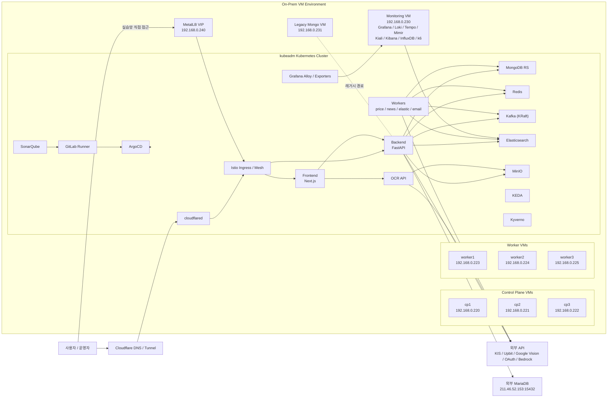

# TUTUM 온프레미스 VM 기반 토폴로지 아키텍처

- 작성일: `2026-03-17`
- 범위: AWS 마이그레이션 이전 최종 운영형 `on-prem VM + kubeadm Kubernetes` 구조
- 목적: TUTUM이 AWS/EKS로 이전되기 전에 어떤 VM 기반 구조로 운영되었는지, 발표 자료나 `draw.io` 설계도에 바로 옮길 수 있도록 정리
- 기준: 이 문서는 "초기 3-Node Docker Compose"가 아니라, 그 이후 발전한 "온프레미스 8대 VM 기반 운영형"을 메인 기준으로 설명합니다.

---

## 0. 문서 기준과 복원 근거

이 문서는 아래 근거를 바탕으로 복원한 VM 기반 아키텍처 문서입니다.

- `backend/app/config.py`
- `docs/archive/backups/K8S_MIGRATION_PLAN.md.bak`
- `docs/archive/backups/K8S_TECH_STACK.md.bak`
- `docs/plans/infra/ONPREM_VM_TO_AWS_MIGRATION_STATUS_2026-03-12.md`
- `k8s-manifests/README.md`
- `k8s-manifests/step1-metallb/*`
- `k8s-manifests/step3-lgtm/*`

즉, 이 문서는 "실제 운영 흔적 + 마이그레이션 계획 문서 + 잔존 VM 조사 결과"를 합쳐서 정리한 구조도 문서입니다.

---

## 1. 요약

AWS 이전의 TUTUM은 단순히 "VM 1~2대에서 앱을 띄운 구조"가 아니라, `온프레미스 VM 8대` 위에 `kubeadm Kubernetes 클러스터`를 구성하고, 모니터링과 일부 레거시 데이터 경로를 별도 VM으로 분리한 구조였습니다.

- 핵심 앱과 데이터 워크로드는 `cp1~3`, `worker1~3`로 구성된 온프레미스 Kubernetes 클러스터에서 동작했습니다.
- 외부 공개 진입은 크게 두 경로가 있었습니다.
  - 공개 도메인 경로: `Cloudflare Tunnel -> cloudflared -> istio-ingressgateway`
  - 내부/실습망 경로: `MetalLB VIP -> istio-ingressgateway`
- 애플리케이션 계층은 `Next.js + FastAPI + OCR + Kafka workers` 중심이었습니다.
- 데이터 계층은 대부분 클러스터 내부에 두고 `MongoDB`, `Redis`, `Kafka`, `Elasticsearch`, `MinIO`를 운영했습니다.
- 회원/인증의 관계형 데이터는 외부 학원 제공 `MariaDB (211.46.52.153:15432)`를 사용했습니다.
- 모니터링 계층은 클러스터 밖 별도 `monitoring VM`에서 `Grafana / Loki / Tempo / Mimir / Kiali / Kibana / InfluxDB / k6`를 Docker Compose로 운영했습니다.
- 초기에는 `Harbor`와 `3-Node Docker Compose` 시절이 있었지만, AWS 이전 최종 단계에서는 `온프레미스 kubeadm 클러스터 + 별도 monitoring VM + legacy Mongo VM` 형태가 더 정확한 설명입니다.

즉, 이 구조를 한 줄로 요약하면 아래와 같습니다.

> TUTUM의 AWS 이전 구조는 "온프레미스 VM 위에 self-managed Kubernetes를 올리고, 앱/데이터는 클러스터 내부에서 운영하며, 모니터링과 일부 레거시 경로는 별도 VM으로 분리한 하이브리드 VM 아키텍처"였습니다.

---

## 2. 온프레미스 리소스 인벤토리

## 2-1. 네트워크와 진입점

| 구분 | 리소스 | 값 / 이름 | 비고 |
|---|---|---|---|
| VM 운영 환경 | On-Prem VM | VirtualBox / 학원 실습망 기반 | self-managed 환경 |
| 공개 도메인 경로 | Cloudflare Tunnel | `tutum.my`, `admin.tutum.my` 등 | `cloudflared`가 클러스터 ingress로 전달 |
| 내부 실습망 진입 | MetalLB VIP | `192.168.0.240` | `istio-ingressgateway` 외부 IP |
| 클러스터 내부 네트워크 | Calico CNI | namespace 간 통신 제어 | NetworkPolicy 적용 |
| 초기 Host-Only 대역 | `192.168.56.0/24` | 초기 3-node / 일부 레거시 문서 기준 | 부록 참고 |
| 후반 운영/SSH 대역 | `192.168.0.220~231` | cp/worker/monitoring/mongo VM | AWS 이전 최종 운영형 기준 |

## 2-2. VM 목록

| VM | IP | 역할 | 비고 |
|---|---|---|---|
| `cp1` | `192.168.0.220` | kubeadm control-plane 1 | `etcd`, `apiserver`, `controller-manager`, `scheduler` |
| `cp2` | `192.168.0.221` | kubeadm control-plane 2 | control-plane quorum |
| `cp3` | `192.168.0.222` | kubeadm control-plane 3 | control-plane quorum |
| `worker1` | `192.168.0.223` | app/data/storage worker | SonarQube, Kafka, MongoDB, Redis, MinIO 일부 |
| `worker2` | `192.168.0.224` | infra/app/data worker | ArgoCD, Istio, KEDA, Kyverno, backend, ocr, Kafka, MongoDB, Redis, MinIO 일부 |
| `worker3` | `192.168.0.225` | ingress/app/data worker | frontend, backend, email-worker, gitlab-runner, ES, Kafka, MongoDB, Redis, MinIO 일부 |
| `monitoring` | `192.168.0.230` | 별도 monitoring VM | Grafana, Loki, Tempo, Mimir, Kibana, Kiali, InfluxDB, k6 |
| `mongo` | `192.168.0.231` | legacy standalone MongoDB VM | 후반에는 조건부 종료 대상 |

## 2-3. 클러스터와 플랫폼

| 구분 | 현재 리소스 | 값 / 이름 | 비고 |
|---|---|---|---|
| Kubernetes | kubeadm cluster | on-prem self-managed K8s | AWS EKS 이전 구조 |
| Container runtime | `containerd` | active | kubeadm 표준 런타임 |
| CNI | `Calico` | active | NetworkPolicy |
| External LB | `MetalLB` | VIP `192.168.0.240` | Bare-metal LB |
| Service Mesh | `Istio` | `istiod`, `istio-ingressgateway` | 트래픽 제어 / 가시화 |
| GitOps | `ArgoCD` | in-cluster | 온프레미스 클러스터 배포 |
| Autoscaling | `KEDA` | in-cluster | Kafka lag / workload scale |
| Policy | `Kyverno` | in-cluster | 보안 정책 |
| CI runner | `GitLab Runner` | in-cluster | 배포 파이프라인 연계 |

## 2-4. 외부 및 보조 서비스

| 구분 | 리소스 | 값 / 이름 | 비고 |
|---|---|---|---|
| 관계형 DB | 외부 MariaDB | `211.46.52.153:15432` | 회원/인증/관계형 데이터 |
| 객체 저장소 | MinIO | in-cluster | 업로드/백업 |
| 검색 UI | Kibana | monitoring VM | Elasticsearch 탐색 |
| 코드 품질 | SonarQube | worker에 배치 | 후반에는 외부 경로 분리 |
| 레지스트리 | Harbor | 초기/과도기 사용 | 후반 문서에선 GitLab Registry 전환 흔적 존재 |
| AI | Amazon Bedrock | backend / Node3 consumer 연동 | 후기 단계에서 활성화 |

---

## 3. 공개 진입점

| 도메인 / 경로 | 실제 대상 | 목적 |
|---|---|---|
| `https://tutum.my/` | Cloudflare Tunnel -> `cloudflared` -> `istio-ingressgateway` -> frontend | 메인 서비스 |
| `https://admin.tutum.my/` | Cloudflare Tunnel -> `cloudflared` -> ingress -> monitoring/Grafana 계열 | 운영 대시보드 |
| `https://minio.tutum.my/` | ingress -> MinIO Console | 객체 저장소 관리 |
| `192.168.0.240` | MetalLB VIP -> `istio-ingressgateway` | 실습망 직접 진입 |

참고:

- 공개 도메인 진입은 AWS처럼 `ALB`가 아니라 `Cloudflare Tunnel` 기반 성격이 강했습니다.
- 실습망 내부에서는 `MetalLB`가 사실상 bare-metal load balancer 역할을 했습니다.

---

## 4. 실제로 동작했던 워크로드

## 4-1. Control Plane / Platform

| 그룹 | 주요 컴포넌트 |
|---|---|
| Control Plane | `etcd`, `kube-apiserver`, `kube-controller-manager`, `kube-scheduler`, `coredns` |
| Platform | `ArgoCD`, `cert-manager`, `Istio`, `KEDA`, `Kyverno`, `GitLab Runner`, `cloudflared` |

## 4-2. 앱 계층

| 워크로드 | 역할 | 비고 |
|---|---|---|
| `frontend` | Next.js UI | 사용자 웹 서비스 |
| `backend` | FastAPI API | 메인 비즈니스 로직 |
| `ocr` | OCR API | 이미지 자산 인식 |
| `email-worker` | 메일 전송 처리 | 인증/알림성 메일 |
| `price-producer` | 외부 시세 수집 | KIS / Upbit 연동 |
| `price-consumer` | 시세 캐싱 | Kafka -> Redis |
| `news-producer` | 뉴스 수집 | 외부 뉴스 소스 |
| `news-consumer` | 뉴스 저장 | Kafka -> MongoDB |
| `elastic-consumer` | 뉴스 인덱싱 | Kafka -> Elasticsearch |

## 4-3. 데이터 및 스토리지 계층

| 워크로드 | 역할 | 비고 |
|---|---|---|
| `MongoDB ReplicaSet` | 문서 DB | 자산/뉴스/AI 관련 문서 |
| `Redis` | 캐시/세션 | 실시간 데이터와 캐싱 |
| `Kafka (KRaft)` | 이벤트 버스 | 시세/뉴스 파이프라인 |
| `Elasticsearch` | 검색/RAG 조회 | 뉴스 인덱스 |
| `MinIO` | 오브젝트 저장소 | 파일 업로드/백업 |
| `legacy Mongo VM` | 과거 단독 Mongo | 후반에 정리 대상 |
| `외부 MariaDB` | 회원/인증 DB | 클러스터 밖 학원 제공 DB |

## 4-4. 모니터링 및 운영 계층

| 위치 | 주요 컴포넌트 |
|---|---|
| in-cluster | `Grafana Alloy`, `node-exporter` 등 수집기 |
| monitoring VM | `Grafana`, `Loki`, `Tempo`, `Mimir`, `Kiali`, `Kibana`, `InfluxDB`, `k6` |

---

## 5. 기술 스택 요약

## 5-1. 인프라 / 클러스터

- `On-Prem VM`
- `kubeadm`
- `containerd`
- `Calico`
- `MetalLB`
- `Istio`

## 5-2. 애플리케이션 계층

- `Frontend`: `Next.js`
- `Backend API`: `FastAPI`
- `OCR API`
- `Workers`: `price`, `news`, `elastic`, `email`

## 5-3. 데이터 계층

- `MongoDB`
- `Redis`
- `Kafka (KRaft)`
- `Elasticsearch`
- `MinIO`
- 외부 `MariaDB`

## 5-4. 운영 / 관측

- `Grafana`
- `Loki`
- `Tempo`
- `Mimir`
- `Grafana Alloy`
- `Kiali`
- `Kibana`
- `k6`
- `InfluxDB`

## 5-5. CI/CD / 보안 / 배포

- `GitLab CI/CD`
- `GitLab Runner`
- `ArgoCD`
- `SonarQube`
- `Trivy`
- `Cosign`
- `Kyverno`
- `Harbor` 또는 `GitLab Registry` 과도기 사용

## 5-6. 외부 연동

- `Google Cloud Vision API`
- `KIS API`
- `Upbit API`
- `Google / Kakao / Naver OAuth`
- `Amazon Bedrock` (후기 AI 기능)

---

## 6. 핵심 런타임 흐름

## 6-1. 사용자 웹 요청 흐름

1. 사용자가 `tutum.my` 접속
2. `Cloudflare Tunnel`이 요청을 `cloudflared`로 전달
3. `cloudflared`가 클러스터 내부 `istio-ingressgateway`로 연결
4. `Istio`가 `frontend` 또는 필요한 내부 서비스로 라우팅
5. `frontend`가 `backend`와 `ocr` 등으로 API 요청 전달

보조 경로:

1. 실습망 내부에서는 `192.168.0.240` MetalLB VIP로 직접 접근
2. `MetalLB -> istio-ingressgateway -> frontend/backend` 흐름으로 전달

## 6-2. 뉴스 및 AI 흐름

1. `news-producer`가 외부 금융/코인 뉴스를 수집
2. 수집 데이터가 `Kafka` 토픽으로 발행
3. `news-consumer`가 문서를 `MongoDB`에 저장
4. `elastic-consumer`가 `Elasticsearch` 인덱스를 갱신
5. 후기 단계에서는 일부 문서에 대해 `Bedrock` 임베딩까지 생성
6. 사용자가 AI 질문 시 `backend`가 MongoDB/ES 기반으로 컨텍스트를 조합해 응답

## 6-3. 시세 흐름

1. `price-producer`가 `KIS API`, `Upbit API`에서 시세 수집
2. `Kafka`에 시세 이벤트 발행
3. `price-consumer`가 이를 소비해 `Redis`에 캐시 저장
4. `backend`와 `frontend`가 Redis 기반으로 빠른 시세 조회 제공

## 6-4. OCR 흐름

1. 사용자가 이미지를 업로드
2. `frontend`가 `ocr` 서비스 호출
3. `ocr`가 파일을 `MinIO`에 저장
4. `ocr`가 `Google Cloud Vision API` 호출
5. 인식 결과를 `backend/frontend`에 반환

## 6-5. 모니터링 흐름

1. 클러스터의 노드/파드가 메트릭, 로그, 트레이스를 생성
2. `Grafana Alloy`와 exporter가 이를 수집
3. 수집된 telemetry가 별도 `monitoring VM`으로 전송
4. `Grafana / Loki / Tempo / Mimir`가 조회와 시각화를 담당
5. `Kiali`, `Kibana`, `k6`, `InfluxDB`가 운영 분석을 보조

## 6-6. 배포 흐름

1. 개발자가 `GitLab`에 코드 push
2. `GitLab CI`가 lint/test/scan/build 수행
3. 시기별로 `Harbor` 또는 `GitLab Registry`에 이미지 저장
4. `ArgoCD`가 매니페스트를 읽어 on-prem Kubernetes에 반영

---

## 7. 아키텍처 다이어그램 (Mermaid)

아래 Mermaid는 발표 자료 초안, GitHub Markdown, draw.io 재작성용 기준으로 사용할 수 있습니다.

---

## 8. Draw.io 배치 가이드

슬라이드형 아키텍처 이미지로 다시 그릴 때는 아래 배치가 가장 자연스럽습니다.

## 8-1. 최상단

- 왼쪽: `사용자 / 운영자`
- 상단 중앙: `Cloudflare DNS / Tunnel`
- 상단 오른쪽: `외부 API`, `외부 MariaDB`

## 8-2. 메인 바깥 박스

- 가장 큰 박스: `On-Prem VM Environment`
- 그 안을 4개 영역으로 나눕니다.
  - `Control Plane`
  - `Worker`
  - `Monitoring`
  - `Legacy`

## 8-3. 왼쪽 상단

- `cp1`, `cp2`, `cp3`
- control-plane 3중화 구조를 세로 또는 가로로 배치

## 8-4. 중앙

- `kubeadm Kubernetes Cluster` 큰 박스
- 내부를 아래 그룹으로 나눕니다.
  - `Platform`: ArgoCD, KEDA, Kyverno, GitLab Runner, cloudflared
  - `Ingress/Mesh`: Istio Ingress, Istio Mesh
  - `App`: frontend, backend, ocr, workers
  - `Data`: MongoDB, Redis, Kafka, Elasticsearch, MinIO
  - `Observability`: Alloy / exporters

## 8-5. 오른쪽

- `Monitoring VM`
- 내부에 `Grafana`, `Loki`, `Tempo`, `Mimir`, `Kiali`, `Kibana`, `InfluxDB`, `k6`

## 8-6. 하단

- `Legacy Mongo VM`
- `외부 MariaDB`
- 필요하면 점선으로 "레거시/외부 의존"으로 표시

## 8-7. 진입점 강조

- `Cloudflare Tunnel -> cloudflared -> Istio` 경로를 가장 굵게 표시
- 보조로 `MetalLB VIP -> Istio` 경로를 내부 실습망 접근으로 따로 표시

---

## 9. AWS 구조와 혼동하지 말아야 할 점

이 VM 기반 문서를 볼 때 아래 항목은 AWS 구조와 반드시 구분해서 봐야 합니다.

현재 AWS 구조와 다른 점:

- `ALB`, `Route53`, `WAF`, `ACM`, `EKS`, `RDS`, `S3`가 메인이 아님
- 엣지 진입은 `Cloudflare Tunnel`과 `MetalLB`가 핵심
- 클러스터는 `EKS`가 아니라 `kubeadm self-managed`
- 모니터링은 별도 `monitoring VM`
- 관계형 DB는 `RDS`가 아니라 외부 학원 제공 `MariaDB`
- 객체 저장소는 `S3`가 아니라 `MinIO` 중심

과도기/레거시로 별도 표시해야 하는 것:

- `Harbor`
- `legacy Mongo VM`
- 초기 `3-Node Docker Compose`

---

## 10. 발표 자료용 캡션 추천 문구

다이어그램 아래에는 아래 문장을 쓰면 자연스럽습니다.

> TUTUM의 AWS 이전 구조는 온프레미스 VM 위에 self-managed Kubernetes를 구성한 형태로, 사용자 트래픽은 Cloudflare Tunnel 또는 MetalLB를 통해 Istio ingress로 유입되고, 앱과 데이터는 클러스터 내부에서 운영되며, 모니터링은 별도 monitoring VM, 관계형 계정 데이터는 외부 MariaDB를 사용하는 하이브리드 VM 아키텍처였습니다.

---

## 11. 부록: 더 초기 단계의 3-Node Docker Compose 구조

AWS 이전에도 더 초기에 아래와 같은 `3-Node Docker Compose` 시절이 있었습니다.

| 노드 | 추정 IP | 주요 역할 |
|---|---|---|
| `Node1` | `192.168.56.11` | `Nginx`, `Frontend`, `Backend` |
| `Node2` | `192.168.56.12` | `Redis`, `MinIO`, `Harbor` |
| `Node3` | `192.168.56.13` | `Elasticsearch`, `Kafka`, `Workers`, 후기 `Kibana` |

이 시기의 핵심 특징:

- `VirtualBox 3-Node` 환경
- `Docker Compose` 중심 운영
- `Harbor`를 통한 이미지 배포
- `MongoDB Atlas`를 임시 외부 DB로 사용하던 시기 존재
- 이후 규모가 커지면서 `온프레미스 kubeadm 8VM 구조`로 발전

즉, 발표에서 "처음에는 VM 3대로 시작했고, 이후 self-managed Kubernetes 기반 8VM 구조를 거쳐 AWS/EKS로 이전했다"라고 설명하면 흐름이 가장 자연스럽습니다.

---

## 12. 아키텍처 참고 메모

- 이 문서는 "AWS 이전 최종 운영형"을 메인 기준으로 정리한 문서입니다.
- 특정 시점에 따라 `Harbor`와 `GitLab Registry`, `legacy Mongo`와 `MongoDB RS`, `직접 접근`과 `Cloudflare Tunnel`이 병행되던 과도기 흔적이 있습니다.
- 따라서 발표나 설계도에서는 "초기 구조", "최종 온프레미스 구조", "현재 AWS 구조"를 분리해서 보여주는 것이 가장 명확합니다.
