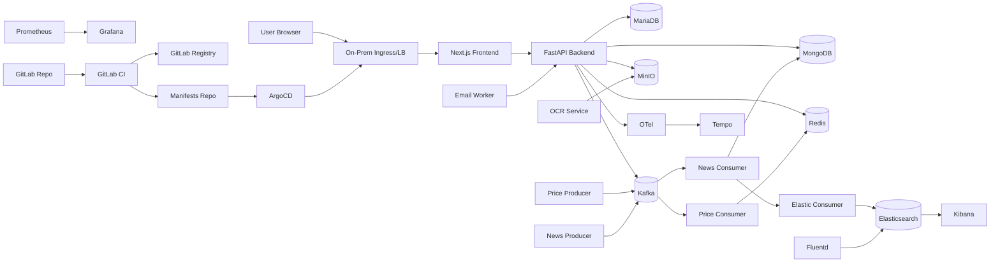
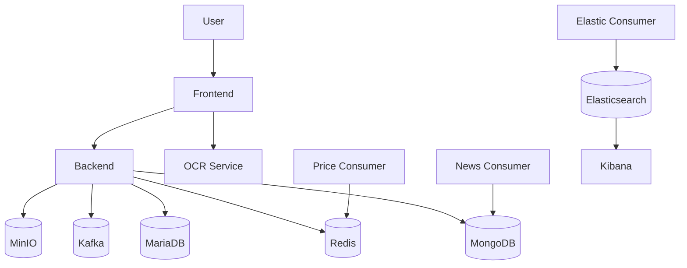
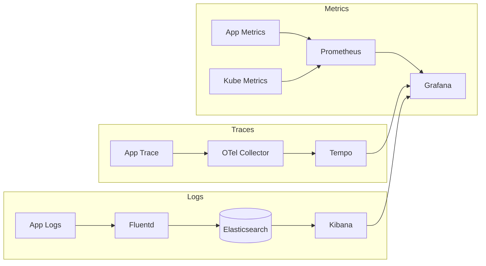
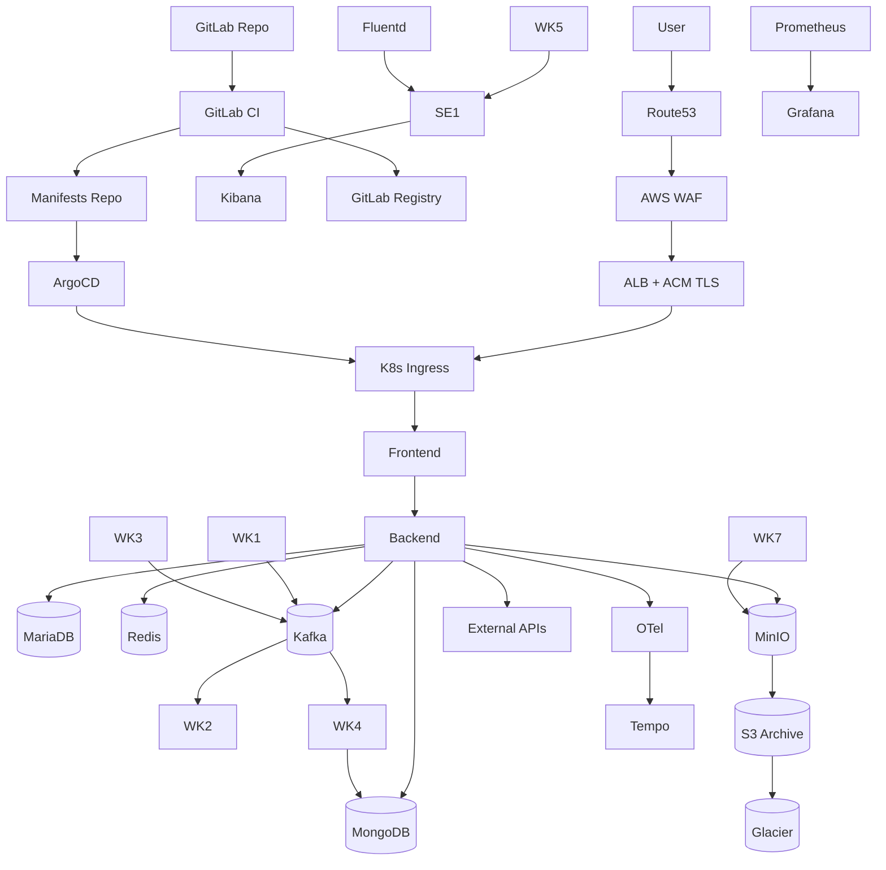
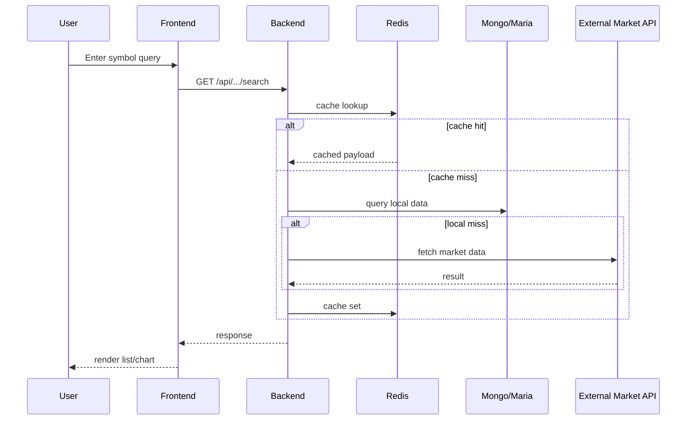
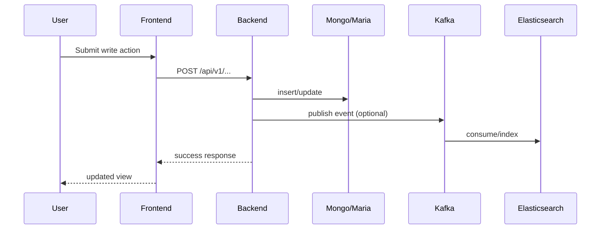
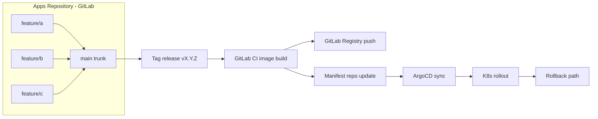

# TUTUM TOPOLOGY BLUEPRINT (Draw.io Ready)

Date: `2026-03-03`  
Owner: `ruby team`  
Intent: Create a "draw from this doc directly" blueprint similar to presentation-style topology slides.

This file is intentionally separate and does not modify existing topology docs.

---

## 0. Fixed assumptions (for all pages)

1. Source/SCM/CI/CD/Registry: **GitLab only**
2. GitHub: not used
3. Runtime target: self-managed Kubernetes
4. AWS sample: `self-managed k8s on EC2` (no EKS for current baseline)
5. Edge strategy: `Route53 + ACM + ALB + AWS WAF`
6. Cloudflare Tunnel: not used in target architecture
7. Object storage archive path: `MinIO -> S3 -> Glacier`
8. Security policies (`Kyverno/Cosign`): WIP

---

## 1. Visual system (use this in draw.io)

## 1-1. Canvas

- Aspect: 16:9
- Suggested: `1920 x 1080`
- Grid: `20px`
- Main font: `Pretendard` or `Noto Sans` (if unavailable, `Arial`)

## 1-2. Color legend

- User/API request: `#2563EB` (blue solid)
- Async event stream (Kafka/Queue): `#7C3AED` (purple dashed)
- Data write/replication/archive: `#16A34A` (green solid)
- CI/CD/GitOps deploy path: `#EA580C` (orange solid)
- Security policy/deny path: `#DC2626` (red solid)
- WIP border/tag: `#F59E0B` (amber)

## 1-3. Box style

- Domain boundary (VPC/Namespace): dashed border, 2px
- Service box: rounded rectangle, 1px
- Stateful data box: cylinder or DB icon box
- External SaaS: cloud shape

---

## 2. Global component IDs

Use these IDs consistently across all pages.

- `U1` User/Browser
- `DNS1` Route53
- `WAF1` AWS WAF
- `ALB1` ALB
- `ING1` K8s Ingress/Gateway
- `FE1` Frontend (Next.js)
- `BE1` Backend (FastAPI)
- `WK1` Price Producer
- `WK2` Price Consumer
- `WK3` News Producer
- `WK4` News Consumer
- `WK5` Elastic Consumer
- `WK6` Email Worker
- `WK7` OCR Service
- `DB1` MongoDB
- `DB2` MariaDB
- `CA1` Redis
- `MQ1` Kafka
- `SE1` Elasticsearch
- `SE2` Kibana
- `OS1` MinIO
- `OS2` S3
- `OS3` Glacier
- `OBS1` Prometheus
- `OBS2` Grafana
- `OBS3` OTel Collector
- `OBS4` Tempo
- `OBS5` Fluentd
- `GIT1` GitLab Repo
- `GIT2` GitLab CI
- `GIT3` GitLab Registry
- `GIT4` Manifests Repo
- `GIT5` ArgoCD
- `OPS1` Jira
- `OPS2` Slack
- `OPS3` Notion

---

## 3. PAGE-01: On-Prem + K8s current overview

## 3-1. Slide objective

Show full current system in one page:
User entry, app services, worker pipelines, data stores, ops tools.

## 3-2. Mermaid draft (quick visual)

## 3-3. Draw.io coordinate map

Coordinates are approximate for 1920x1080.

| ID | x | y | w | h |
|---|---:|---:|---:|---:|
| U1 | 80 | 120 | 120 | 60 |
| ING1 | 260 | 110 | 180 | 80 |
| FE1 | 500 | 100 | 180 | 80 |
| BE1 | 740 | 100 | 200 | 80 |
| WK1 | 500 | 260 | 170 | 70 |
| WK2 | 700 | 260 | 170 | 70 |
| WK3 | 500 | 360 | 170 | 70 |
| WK4 | 700 | 360 | 170 | 70 |
| WK5 | 900 | 360 | 170 | 70 |
| WK6 | 500 | 460 | 170 | 70 |
| WK7 | 700 | 460 | 170 | 70 |
| DB1 | 1080 | 120 | 160 | 80 |
| DB2 | 1260 | 120 | 160 | 80 |
| CA1 | 1440 | 120 | 160 | 80 |
| MQ1 | 1080 | 260 | 160 | 80 |
| SE1 | 1260 | 360 | 160 | 80 |
| SE2 | 1440 | 360 | 160 | 80 |
| OS1 | 1260 | 500 | 160 | 80 |
| OBS1 | 1080 | 620 | 160 | 80 |
| OBS2 | 1260 | 620 | 160 | 80 |
| OBS3 | 900 | 620 | 160 | 80 |
| OBS4 | 1440 | 620 | 160 | 80 |
| OBS5 | 720 | 620 | 160 | 80 |
| GIT1 | 120 | 780 | 180 | 70 |
| GIT2 | 340 | 780 | 180 | 70 |
| GIT3 | 560 | 780 | 200 | 70 |
| GIT4 | 800 | 780 | 200 | 70 |
| GIT5 | 1040 | 780 | 180 | 70 |
| OPS1 | 1320 | 780 | 130 | 60 |
| OPS2 | 1470 | 780 | 130 | 60 |
| OPS3 | 1620 | 780 | 130 | 60 |

## 3-4. Connector list (add labels)

- `R-01`: U1 -> ING1 (HTTPS)
- `R-02`: ING1 -> FE1
- `R-03`: FE1 -> BE1 (/api)
- `D-01`: BE1 -> DB1 (read/write)
- `D-02`: BE1 -> DB2 (read/write)
- `C-01`: BE1 -> CA1 (cache/session)
- `E-01`: WK1 -> MQ1 (price publish)
- `E-02`: MQ1 -> WK2 (price consume)
- `C-02`: WK2 -> CA1 (price cache update)
- `E-03`: WK3 -> MQ1 (news publish)
- `E-04`: MQ1 -> WK4 (news consume)
- `D-03`: WK4 -> DB1 (news store)
- `E-05`: WK4 -> WK5 (index event)
- `D-04`: WK5 -> SE1 (index write)
- `R-04`: SE2 -> Admin (search/log view)
- `D-05`: WK7 -> OS1 (ocr image save)
- `O-01`: BE1 -> OBS3 (trace emit)
- `O-02`: OBS3 -> OBS4
- `O-03`: OBS5 -> SE1
- `O-04`: OBS1 -> OBS2
- `CI-01`: GIT1 -> GIT2
- `CI-02`: GIT2 -> GIT3
- `CI-03`: GIT2 -> GIT4
- `CI-04`: GIT4 -> GIT5
- `CI-05`: GIT5 -> K8s deploy
- `N-01`: CI fail -> OPS2 (slack alert)
- `N-02`: Issue sync -> OPS1

---

## 4. PAGE-02: External access + internal traffic control

## 4-1. Slide objective

Show ingress path, service-to-service path, and restricted egress policy intent.

## 4-2. Mermaid draft

## 4-3. Policy overlay checklist

Add red "deny" lines and green "allow" lines:

- Allow:
  - FE1 -> BE1 (443/80 internal)
  - BE1 -> DB1 (`27017`)
  - BE1 -> DB2 (`3306`)
  - BE1 -> CA1 (`6379`)
  - BE1 -> MQ1 (`9092`)
  - BE1 -> OS1 (`9000`)
- Deny by default:
  - FE1 direct to DB layer
  - Worker direct to MariaDB (except required cases)
  - Public direct to internal data services

## 4-4. Draw.io side panel (must add)

Right side mini-table:

- Ingress allowed: 80, 443
- Internal ports: 3000, 8000, 8002, 6379, 9092, 27017, 3306, 9000
- External egress allow-list: KIS, Upbit/Binance, AWS Bedrock, SES/SQS
- Security status: `Kyverno/Cosign = WIP`

---

## 5. PAGE-03: Observability architecture

## 5-1. Slide objective

Three lanes: Metrics, Traces, Logs.

## 5-2. Mermaid draft

## 5-3. Draw.io composition

- Left column (vertical): Metric, Trace, Log icons
- Middle: collectors/processors
- Right: storage and visualization (Prometheus, Tempo, Elasticsearch, Grafana/Kibana)

## 5-4. Alert connectors

- `AL-01`: Prometheus Alert -> Slack
- `AL-02`: High 5xx -> Slack + Jira
- `AL-03`: Kafka lag threshold -> Slack

---

## 6. PAGE-04: Tool chain transition (On-Prem -> AWS)

## 6-1. Slide objective

Single horizontal comparison, not deep networking.

## 6-2. Columns

Use six columns:

1. Database
2. CI
3. Test/Scan
4. Artifacts
5. Deploy
6. Observability

## 6-3. Content rows

Row A (On-Prem / Current):
- Database: MongoDB, MariaDB, Redis, Elasticsearch
- CI: GitLab CI runner
- Test/Scan: SonarQube, Trivy
- Artifacts: GitLab Registry
- Deploy: ArgoCD + self-managed K8s
- Observability: Prometheus, Grafana, OTel, Tempo, EFK

Row B (AWS / Target Sample):
- Database: MongoDB/MariaDB (EC2 managed by team) + Redis option
- CI: GitLab CI
- Test/Scan: SonarQube, Trivy (same)
- Artifacts: GitLab Registry (same)
- Deploy: ArgoCD + self-managed K8s on EC2
- Observability: CloudWatch + Prometheus/Grafana + Tempo/EFK hybrid

## 6-4. Key note

Use callout:
- "Registry remains GitLab (not Harbor)"
- "No EKS in current baseline"

---

## 7. PAGE-05: AWS sample architecture (detailed)

## 7-1. Slide objective

Most detailed page. Similar complexity to the reference image.

## 7-2. Layout zones

Top row (edge/control):
- `DNS1 Route53`
- `ALB1 ALB`
- `WAF1 WAF`
- `ACM` note

Middle row (app plane in private subnets):
- `FE1`, `BE1`, `WK1..WK7`
- `ING1` in front of FE/BE
- show 2 AZ split for worker nodes

Bottom row (data + archive):
- `DB1`, `DB2`, `CA1`, `MQ1`, `SE1`, `SE2`, `OS1`
- archive branch to `OS2 S3` then `OS3 Glacier`

Right side (ops/security):
- `GIT1..GIT5`
- `OBS1..OBS5`
- security callout (`Kyverno/Cosign WIP`)

## 7-3. Mermaid draft

## 7-4. Connector labels (required on slide)

- `A-01` User DNS lookup
- `A-02` HTTPS to ALB
- `A-03` WAF inspection
- `A-04` ingress route
- `A-05` FE -> BE API
- `A-06` BE -> data
- `A-07` workers event stream
- `A-08` MinIO -> S3 archive
- `A-09` S3 lifecycle -> Glacier
- `A-10` GitLab CI/CD path
- `A-11` Observability export

---

## 8. PAGE-06: User scenario - Search flow

## 8-1. Sequence diagram (draw as swimlanes)

## 8-2. Draw.io extra notes

- Add latency badges:
  - cache hit: `<100ms`
  - cache miss + external: `300ms~2s`
- Add failure branch:
  - external API fail -> fallback last_good cache

---

## 9. PAGE-07: User scenario - Review/write flow (generic content write)

Use if your presentation needs "write flow" similar to sample.

## 9-1. Flow

1. User writes review/comment/portfolio memo in UI
2. FE sends authenticated POST to BE
3. BE validates + stores to Mongo/Maria
4. Event optionally published to Kafka
5. Async consumers index to Elasticsearch
6. UI fetches refreshed list

## 9-2. Mermaid

---

## 10. PAGE-08: Git strategy (GitLab trunk-based variant)

## 10-1. Visual structure

Top lane: manifests repo (`main`, `stg`)  
Middle lane: CI pipeline build and image push  
Bottom lane: app repo (`main` trunk + short-lived feature branches)

## 10-2. Mermaid

## 10-3. Required labels

- `G-01`: feature -> main merge
- `G-02`: tag release webhook
- `G-03`: image build and push
- `G-04`: manifest update
- `G-05`: argocd sync
- `G-06`: rollback trigger

---

## 11. Final QA before presenting

1. Every page has title + legend + date + version
2. Every major arrow has ID label
3. AS-IS / TO-BE / WIP tags are visible
4. Security status (`Kyverno/Cosign WIP`) appears at least on two pages
5. User story pages (search/write) are understandable without code context
6. "GitLab only" and "MinIO -> S3 -> Glacier" are explicitly visible

---

## 12. Build order (fastest path)

1. Draw P1 with blocks only
2. Copy style to P2/P3
3. Draw P5 AWS detailed page
4. Add P6/P7 scenarios
5. Finish P8 Git strategy
6. Apply label IDs and legend in final pass

